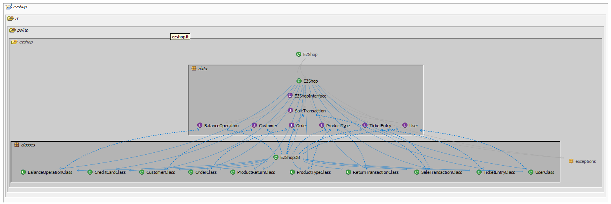

# Design assessment


```
<The goal of this document is to analyse the structure of your project, compare it with the design delivered
on April 30, discuss whether the design could be improved>
```

# Levelized structure map
```
<Applying Structure 101 to your project, version to be delivered on june 4, produce the Levelized structure map,
with all elements explosed, all dependencies, NO tangles; and report it here as a picture>
```


# Structural over complexity chart
```
<Applying Structure 101 to your project, version to be delivered on june 4, produce the structural over complexity chart; and report it here as a picture>
```


# Size metrics

```
<Report here the metrics about the size of your project, collected using Structure 101>
```


| Metric                                    | Measure |
| ----------------------------------------- | ------- |
| Packages                                  |    6    |
| Classes (outer)                           |   40    |
| Classes (all)                             |   40    |
| NI (number of bytecode instructions)      |   11 K  |
| LOC (non comment non blank lines of code) |  ~ 5 K  |


# Items with XS

```
<Report here information about code tangles and fat packages>
```

| Item                    | Tangled | Fat  | Size  | XS   |
| ----------------------- | ------- | ---- | ----- | ---- |
| ezshop.it.polito.ezshop | 9,81%   | 4    | 11061 | 1085 |


# Package level tangles

```
<Report screen captures of the package-level tangles by opening the items in the "composition perspective" 
(double click on the tangle from the Views->Complexity page)>
```

 


# Summary analysis
```
<Discuss here main differences of the current structure of your project vs the design delivered on April 30>
<Discuss if the current structure shows weaknesses that should be fixed>
```