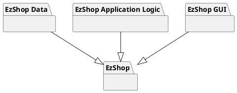
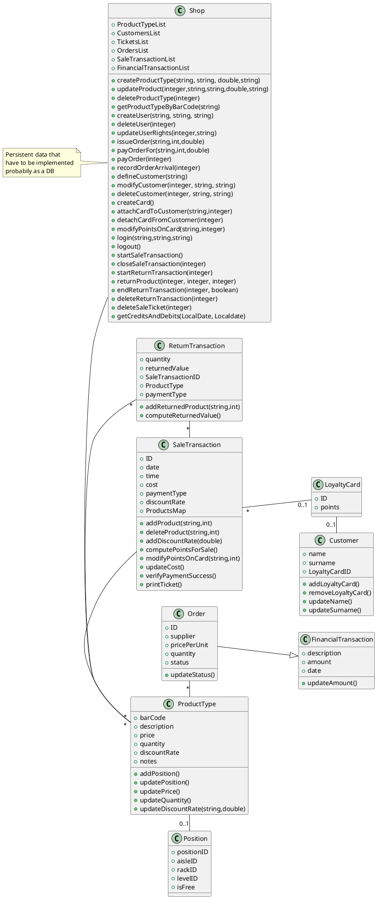
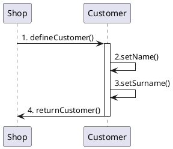
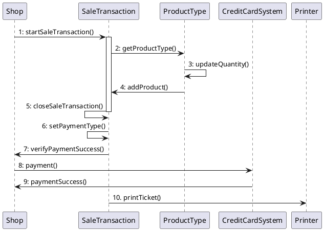
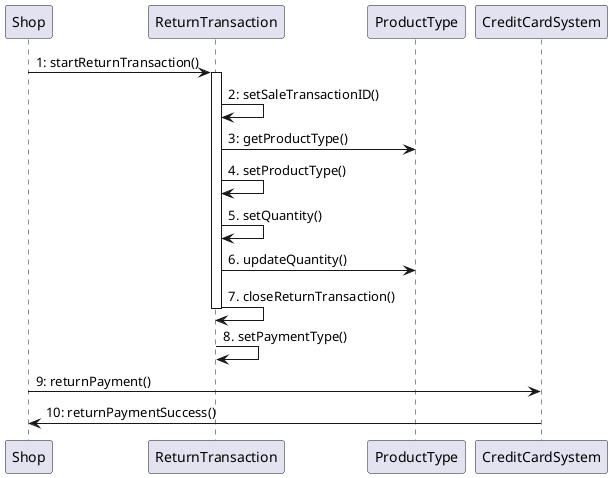

# Design Document 

Authors: Group 38

Date: 24/04/2021

Version: 01

# Contents

- [High level design](#package-diagram)
- [Low level design](#class-diagram)
- [Verification traceability matrix](#verification-traceability-matrix)
- [Verification sequence diagrams](#verification-sequence-diagrams)

# Instructions

The design must satisfy the Official Requirements document, notably functional and non functional requirements

# High level design 

_Architecture_:
* EZShop is a **stand-alone** application.

_Architectural patterns_:
* MVC (because there is a GUI)
* layered - 3 tiered

# Low level design

# Verification traceability matrix

|     | Shop | SaleTransaction | ProductType | Position | LoyaltyCard | Customer | Order | ReturnTransaction | FinancialTransaction |
| --- | :----: | :---------------: | :-----------: | :--------: | :-----------: | :--------: | :-----: | :-----------------: | :--------------------: |
| FR1 |X| | | | | | | | |
| FR2 |X| |X| | | | | | |
| FR3 |X| |X|X| | |X| |X|
| FR4 |X| | | |X|X| | | |
| FR5 |X|X|X| | | | |X|X|
| FR6 |X|X| | | | | | | |
| FR7 |X| | | | | | | |X|

# Verification sequence diagrams 
\<select key scenarios from the requirement document. For each of them define a sequence diagram showing that the scenario can be implemented by the classes and methods in the design>

### Scenario 6.1

### Scenario 6.1

### Scenario 8.1
