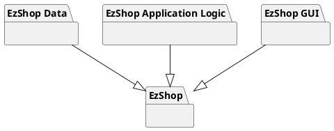
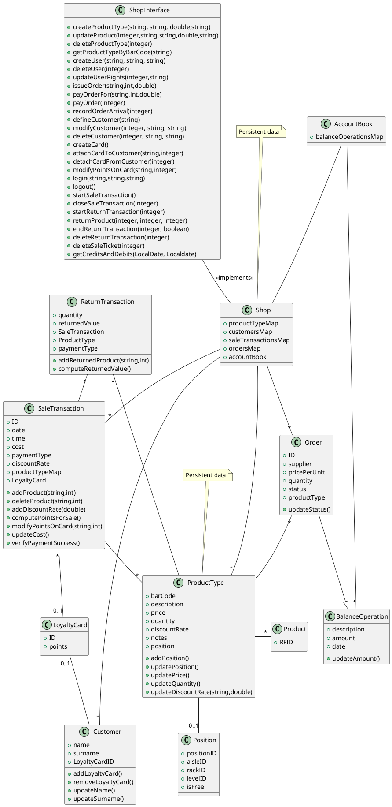
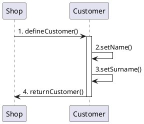
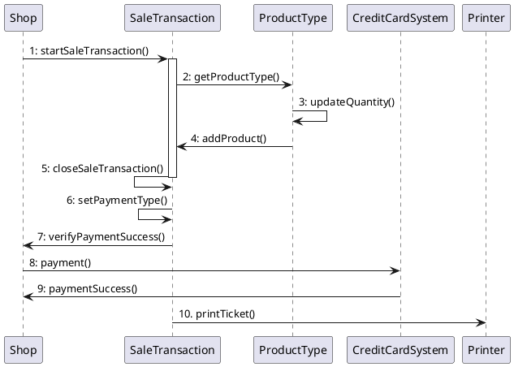
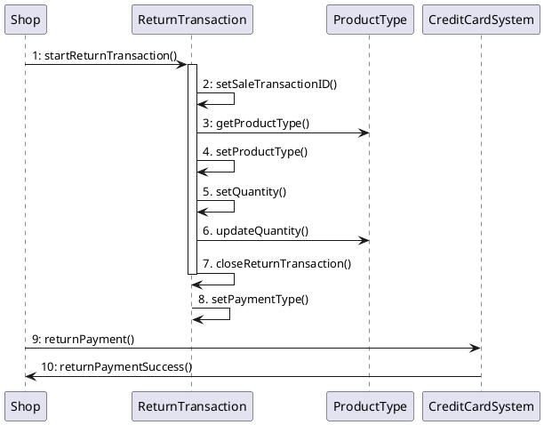

# Design Document 

Authors: Group 38

Date: 08/06/2021

Version: 04

| Version | Changes | 
| ----------------- |:-----------|
| 01 | Added High Level Design and Low Level Design  |
| 02 | Added Verification Traceability Matrix and Verification sequence diagrams |
| 03 | Modified Low Level Design due to Requirements update |
| 04 | Added product class |

# Contents

- [High level design](#package-diagram)
- [Low level design](#class-diagram)
- [Verification traceability matrix](#verification-traceability-matrix)
- [Verification sequence diagrams](#verification-sequence-diagrams)

# Instructions

The design must satisfy the Official Requirements document, notably functional and non functional requirements

# High level design 

_Architecture_:
* EZShop is a **stand-alone** application.

_Architectural patterns_:
* MVC (because there is a GUI)
* layered - 3 tiered

# Low level design

# Verification traceability matrix

|     | Shop | SaleTransaction | ProductType | Position | LoyaltyCard | Customer | Order | ReturnTransaction | BalanceOperation | Product |
| --- | :----: | :---------------: | :-----------: | :--------: | :-----------: | :--------: | :-----: | :-----------------: | :--------------------: | :---:|
| FR1 |X| | | | | | | | | |
| FR2 |X| |X| | | | | | |X|
| FR3 |X| |X|X| | |X| |X|X|
| FR4 |X| | | |X|X| | | | |
| FR5 |X|X|X| | | | |X|X|X|
| FR6 |X|X| | | | | | | | |
| FR7 |X| | | | | | | |X| |

# Verification sequence diagrams 

### Scenario 4.1

### Scenario 6.1

### Scenario 8.1
