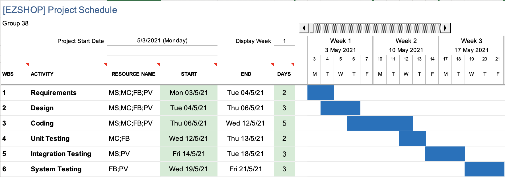

# Project Estimation  
Authors: Group 38
Date: 27/04/2021
Version: 01
# Contents
- [Estimate by product decomposition](#estimate-by-product-decomposition)
- [Estimate by activity decomposition](#estimate-by-activity-decomposition)

# Estimation approach
<Consider the EZShop project as described in YOUR requirement document, assume that you are going to develop the project INDEPENDENT of the deadlines of the course>
# Estimate by product decomposition
### 
|             | Estimate                        |             
| ----------- | ------------------------------- |  
| NC =  Estimated number of classes to be developed   |                23             |             
|  A = Estimated average size per class, in LOC       |            200                | 
| S = Estimated size of project, in LOC (= NC * A) | 4600 |
| E = Estimated effort, in person hours (here use productivity 10 LOC per person hour)  |                  460                    |   
| C = Estimated cost, in euro (here use 1 person hour cost = 30 euro) | 13800 + 1000 for system (pc, cc reader, bc reader and receipt printer) | 
| Estimated calendar time, in calendar weeks (Assume team of 4 people, 8 hours per day, 5 days per week ) |          3          |               
# Estimate by activity decomposition
### 
|         Activity name    | Estimated effort (person hours)   |             
| ----------- | ------------------------------- | 
| Requirement | 50 |
| Design | 50 |
| Coding | 120 |
| Unit testing | 40 |
| Integration testing | 100 |
| System testing | 100 |
###

# Gantt Chart
Assuming a work time of 8 hours per day and five days a week.

**Labels:**
- _MC_: Marco Capusso
- _MS_: Marco Smorti
- _FB_: Francesco Bonini
- _PV_: Pablo Vejar