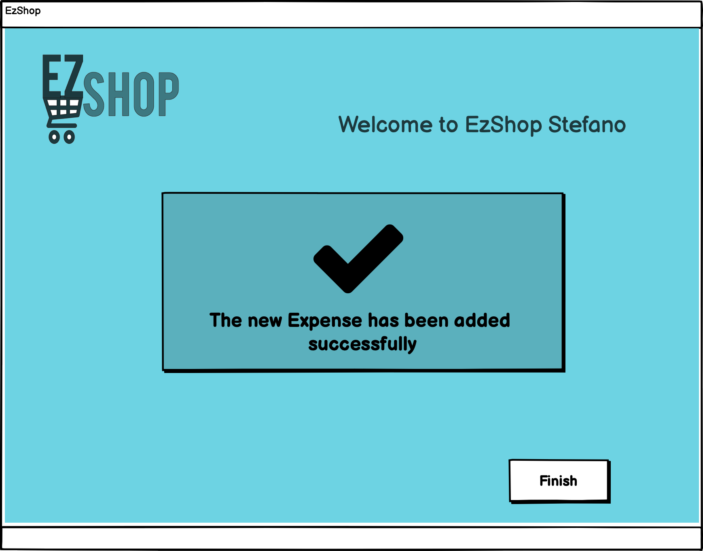

# Graphical User Interface Prototype  

Authors: Group 38

Date: 18/04/2021

Version: 01

| Version | Changes | 
| ----------------- |:-----------|
| 01 | Added GUI Images |

## Use Case 1: Login

Whether the user inputs wrong credential an error message is displayed.

When the user correctly inserts the username and password, he/she is logged in and is able to see the homepage (cashier in this example).

## Use Case 2: Handle Customer Information
The manager is able to select the functionalities that he/she wants to use. The Application displays to each manager only the functionalities to which the manager has access to.

Clicking on the 'Customers' icon, a new window pops up. The user is able to manage Customers or add new Customers.

Wheter the user inserts wrong information an error message is displayed.

After the insertion of the new customer, the user is brought back to the homepage.

Clicking on 'Manage Customers' a list of all the active Customers is displayed. It is possible to delete customers or change their information.

## Use Case 3: Manage Accounting

When clicking on the Accounting icon, the user is prompted to a screen where the user is able to check the incomes and to add a new expense. Furthermore, in the Accounting Manager HomePage is displayed the monthly balance of EzShop (calculated by subtracting the expenses from the profits).

Clicking on the lens button located in each row, allows the user to check the full receipt of a certain day.

In order to add a new expense, an 'Expense Type' has to be provided. The Expense Type allows to classify the different expenses in order to keep track of them.

## Use Case 5: Handle Sale Transaction

## Use Case 6: Manage Inventory and Catalogue

