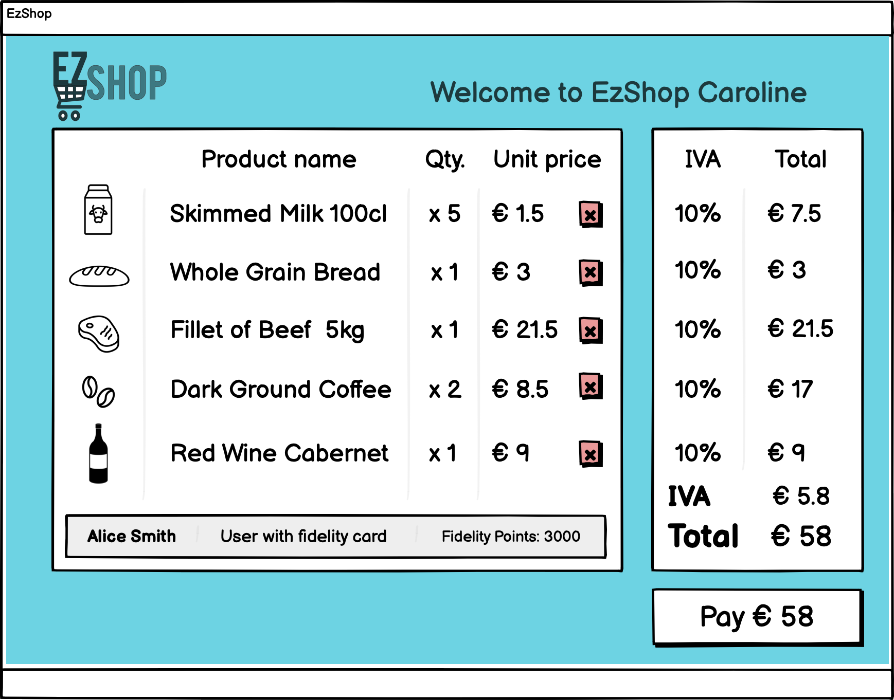
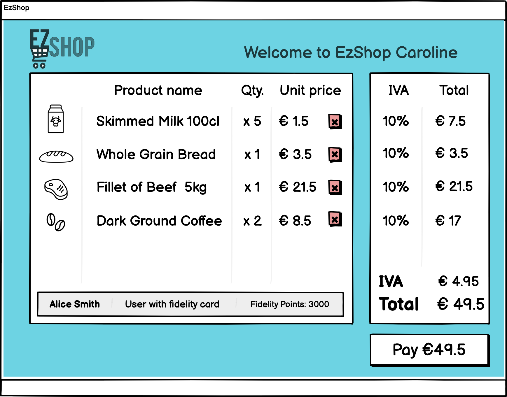
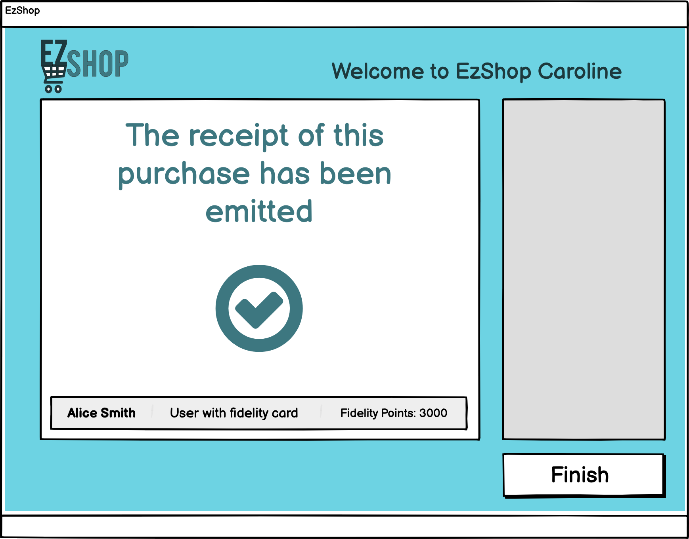

# Graphical User Interface Prototype  

Authors: Group 38

Date: 18/04/2021

Version: 01

| Version | Changes | 
| ----------------- |:-----------|
| 01 | Added GUI Images |

## Use Case 1: Login

Whether the user inputs wrong credential an error message is displayed.

When the user correctly inserts the username and password, he/she is logged in and is able to see the homepage (cashier in this example).

## Use Case 2: Handle Customer Information
The manager is able to select the functionalities that he/she wants to use. The Application displays to each manager only the functionalities to which the manager has access to.

Clicking on the 'Customers' icon, a new window pops up. The user is able to manage Customers or add new Customers.

Wheter the user inserts wrong information an error message is displayed.

After the insertion of the new customer, the user is brought back to the homepage.

Clicking on 'Manage Customers' a list of all the active Customers is displayed. It is possible to delete customers or change their information.

## Use Case 3: Manage Accounting

When clicking on the Accounting icon, the user is prompted to a screen where the user is able to check the incomes and to add a new expense. Furthermore, in the Accounting Manager HomePage is displayed the monthly balance of EzShop (calculated by subtracting the expenses from the profits).

Clicking on the lens button located in each row, allows the user to check the full receipt of a certain day.

In order to add a new expense, an 'Expense Type' has to be provided. The Expense Type allows to classify the different expenses in order to keep track of them.

## Use Case 5: Handle Sale Transaction
When the Cashier logs in, they can select between making a new buy or give the option to the fidelity customers to check if they can purchas prizes with the loyalty points. In this case, the cashier selects making a New Buy.

The customer tells the cashier that she doesn't want anymore the red wine and asks if the cashier can cancel it.

After the shopping has finished, the customer asks the cashier if she can check the fidelity points and ask for a prize.

The customer can only select those in white color, and proceeds to select the tea mug set.

## Use Case 6: Manage Inventory and Catalogue

When the manager selects the inventory funcionalities, they can access to 3 functionalities. In this case, the inventory manager wants to manage the catalogue.

They can select the category of the product and look for products fastly.

If the inventory manager makes an error in the format of text inputs or leaves an input blank, an error occurs.

The inventory manager can also change any information related to products, and updated in case of an offer or errors.

The inventory manager can also manage the inventory of the shop, so he can updates the total ammount of products avaible in store. They can select directly to scan a product or see a list of all the products.

They can select if the product is already in catalogue or is a new product. In this case, is a product already in catalogue.

When the inventory manager selects the list of all products, they can updated it directly from that screen.

The updated quantity shows within the list.

