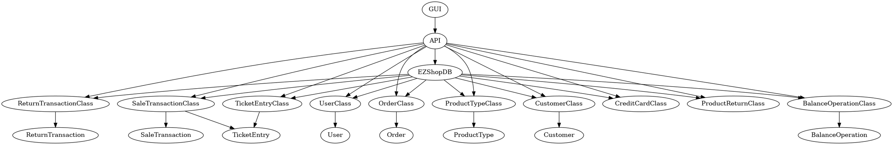

# Integration and API Test Documentation

Authors: Group 38

Date: 26/05/2021

Version: 01

# Contents

- [Dependency graph](#dependency-graph)

- [Integration approach](#integration)

- [Tests](#tests)

- [Coverage of scenarios and FR](#scenario-coverage)
- [Coverage of non-functional requirements](#nfr-coverage)

# Dependency graph 

     
# Integration approach

The integration approach used is **Bottom Up**.

* **Step 1**: corresponds to the Unit Test of leaf classes
* **Step 2**: EZShopDB class tested, which is the interface to DB
* **Step 3**: API class tested using multiple classes test units

#  Tests

## Step 1 - Unit test of leaf classes
| Classes                | JUnit test cases                           |
|------------------------|--------------------------------------------|
| UserClass              | getterAndSetterUserTestCase()              |
| BalanceOperationClass  | getterAndSetterBalanceOperationTestCase()  |
| ReturnTransactionClass | getterAndSetterReturnTransactionTestCase() |
| SaleTransactionClass   | getterAndSetterSaleTransactionTestCase()   |
| UserClass              | getterAndSetterUserTestCase()              |
| OrderClass             | getterAndSetterOrderTestCase()             |
| ProductTypeClass       | getterAndSetterProductTypeTestCase()       |
| CustomerClass          | getterAndSetterCustomerTestCase()          |
| CreditCardClass        | getterAndSetterCreditCardTestCase()        |
| ProductReturnClass     | getterAndSetterProductReturnTestCase()     |
| BalanceOperationClass  | getterAndSetterBalanceOperationTestCase()  |
| TicketEntryClass       | getterAndSetterticketEntryTestCase()       |

## Step 2 - DB Test (+ Leaf classes)
| Classes  | JUnit test cases                       |
|----------|----------------------------------------|
| EZShopDB | All the methods in UnitTestEZShop.java |

## Step 3 - API test (+ DB + Leaf classes)

| Classes                   | JUnit test cases                             |
|---------------------------|----------------------------------------------|
| EZShop, User              | All the methods in UsersTest.java            |
| EZShop, ProductType       | All the methods in ProductsTest.java         |
| EZShop, Order             | All the methods in OrdersTest.java           |
| EZShop, Customer          | All the methods in CustomersTest.java        |
| EZShop, ReturnTransaction | All the methods in ReturnTest.java           |
| EZShop, SaleTransaction   | All the methods in SaleTransactionsTest.java |
| EZShop, Reset Method      | ResetTest.java                               |

# Coverage of Scenarios and FR

| Scenario ID | Functional Requirements covered                                | JUnit  Test(s)                                                                                                                                                                 |
|-------------|----------------------------------------------------------------|--------------------------------------------------------------------------------------------------------------------------------------------------------------------------------|
| 1.1         | FR3.1                                                          | createProductTypeTestCase()                                                                                                                                                    |
| 1.2         | FR4.2, FR3.4                                                   | updatePositionTestCase()                                                                                                                                                       |
| 1.3         | FR3.1, FR3.4                                                   | updateProductTestCase()                                                                                                                                                        |
| 2.1         | FR1.1                                                          | createUserTestCase()                                                                                                                                                           |
| 2.2         | FR1.2, FR1.4, FR1.3                                            | deleteUserTestCase()                                                                                                                                                           |
| 2.3         | FR1.5, FR1.4, FR1.3                                            | updateUserRightsTestCase()                                                                                                                                                     |
| 3.1         | FR4.3                                                          | issueOrderTestCase()                                                                                                                                                           |
| 3.2         | FR4.4                                                          | payOrderForTestCase()                                                                                                                                                          |
| 3.3         | FR4.6, FR4.1                                                   | recordOrderArrivalTestCase()                                                                                                                                                   |
| 4.1         | FR5.1                                                          | defineCustomerTestCase()                                                                                                                                                       |
| 4.2         | FR5.5, FR5.6                                                   | attachCardToCustomerTestCase()                                                                                                                                                 |
| 4.3         | FR5.1                                                          | modifyCustomerTestCase()                                                                                                                                                       |
| 4.4         | FR5.1                                                          | deleteCustomerCardTestCase add                                                                                                                                                 |
| 5.1         | FR1.4, FR1.5                                                   | loginTestCase()                                                                                                                                                                |
| 5.2         | FR1.5                                                          | logoutTestCase()                                                                                                                                                               |
| 6.1         | FR4.1, FR6.1, FR6.2, FR6.7,   FR6.8, FR6.10, FR7, FR8.2        | startSaleTransactionTestCase, addProductToSaleTestCase, receiveCreditCardPaymentTestCase, endSaleTransactionTestCase, receiveCashPaymentTestCase()                             |
| 6.2         | FR4.1, FR6.1, FR6.2, FR6.5, FR6.7, FR6.8, FR6.10, FR7, FR8.2   | startSaleTransactionTestCase, addProductToSaleTestCase, applyDiscountRateToProductTestCase, receiveCashPaymentTestCase, endSaleTransactionTestCase()                           |
| 6.3         | FR4.1, FR6.1, FR6.2, FR6.4, FR6.7, FR6.8, FR6.10, FR7, FR8.2   | startSaleTransactionTestCase, addProductToSaleTestCase, applyDiscountRateToSaleTestCase, receiveCreditCardPaymentTestCase, endSaleTransactionTestCase()                        |
| 6.4         | FR4.1, FR6.1, FR6.2, FR6.7, FR6.8, FR6.10, FR7.2, FR5.7, FR8.2 | startSaleTransactionTestCase, addProductToSaleTestCase, computePointsForSaleTestCase, modifyPointsOnCardTestCase, receiveCreditCardPaymentTestCase, endSaleTransactionTestCase |
| 6.5         | FR4.1, FR6.1, FR6.2, FR6.7, FR6.8, FR6.10, FR6.11, FR7         | startSaleTransactionTestCase, addProductToSaleTestCase,  endSaleTransactionTestCase, deleteSaleTransactionTestCase()                                                           |
| 6.6         | FR4.1, FR6.1, FR6.7,  FR6.10,  FR7.1, FR8.2                    | startSaleTransactionTestCase, addProductToSaleTestCase,  endSaleTransactionTestCase, receiveCashPaymentTestCase()                                                              |
| 7.1         | FR7.2, FR8.2                                                   | receiveCreditCardPaymentTestCase()                                                                                                                                             |
| 7.2         | FR7.2                                                          | receiveCreditCardPaymentTestCase()                                                                                                                                             |
| 7.3         | FR7.2                                                          | receiveCreditCardPaymentTestCase()                                                                                                                                             |
| 7.4         | FR7.1, FR8.2                                                   | receiveCashPaymentTestCase()                                                                                                                                                   |
| 8.1         | FR6.12, FR6.7, FR6.13, FR6.14, FR6, FR4.1, FR7.4, FR8.1        | startReturnTransactionTestCase, returnProductTestCase, endReturnTransactionTestCase, returnCreditCardPaymentTestCase()                                                         |
| 8.2         | FR6.12, FR6.7, FR6.13, FR6.14, FR6, FR4.1, FR7.3, FR8.1        | startReturnTransactionTestCase, returnProductTestCase, endReturnTransactionTestCase, returnCashPaymentTestCase()                                                               |
| 9.1         | FR8.3                                                          | getCreditAndDebitsTestCase()                                                                                                                                                   |
| 10.1        | FR7.4, FR8.1                                                   | returnCreditCardPaymentTestCase, recordBalanceTestCase()                                                                                                                       |
| 10.2        | FR7.3, FR8.1                                                   | returnCaPaymentTestCase, recordBalanceTestCase()                                                                                                                               |

# Coverage of Non Functional Requirements

### 

| Non Functional Requirement | Test name                     |
|----------------------------|-------------------------------|
| NFR4                       | validateProductCodeTestCase() |
| NFR5                       | checkValidCardTestCase()      |
| NFR6                       | createCardTestCase()          |

