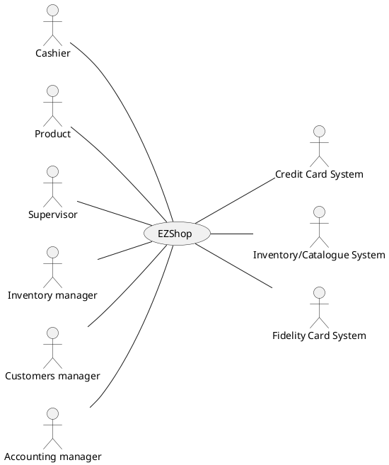

# Requirements Document 

Authors: Group 38

Date: 03/04/2021

Version: 04

| Version | Changes | 
| ----------------- |:-----------|
| 01 | Added Stakeholders  |
| 02 | Added Stories and Personas  |
| 03 | Added Context diagram and interfaces  |
| 04 | Added FR and NFR  |

# Contents

- [Essential description](#essential-description)
- [Stakeholders](#stakeholders)
- [Context Diagram and interfaces](#context-diagram-and-interfaces)
	+ [Context Diagram](#context-diagram)
	+ [Interfaces](#interfaces) 
	
- [Stories and personas](#stories-and-personas)
	+ [Alice](#alice)
	+ [Caroline](#caroline)
	+ [Stefano](#stefano)
	+ [Claudia](#claudia)
- [Functional and non functional requirements](#functional-and-non-functional-requirements)
	+ [Functional Requirements](#functional-requirements)
	+ [Non functional requirements](#non-functional-requirements)
- [Use case diagram and use cases](#use-case-diagram-and-use-cases)
	+ [Use case diagram](#use-case-diagram)
	+ [Use cases](#use-cases)
    	+ [Relevant scenarios](#relevant-scenarios)
- [Glossary](#glossary)
- [System design](#system-design)
- [Deployment diagram](#deployment-diagram)

# Essential description

Small shops require a simple application to support the owner or manager. A small shop (ex a food shop) occupies 50-200 square meters, sells 500-2000 different item types, has one or a few cash registers 
EZShop is a software application to:
* manage sales
* manage inventory
* manage customers
* support accounting

# Stakeholders

| Stakeholder name | Description |
|-----------------|:-----------:|
|Cashier| Uses the software to sell products |
|Customer| Is indirectly involved through the cashier to buy products | 
|Supervisor| Is in charge of cashiers and solves shopping related problems  | 
|Supplier| Supplies all goods and products for the shop |
|Stacker| Its job is to put goods on the shelves in the shop and to ask for refill of missing products |
|Inventory manager| Manages the inventory: amount of pieces, price and (if present) sales. |
|Customers manager| Manages customers' information and fidelity cards |
|Software manager| Maintaner of the software product. It is in charge of solving problems related to the software |
|Accounting manager|Handler of the accounting system of the shop|
|Credit Card System|Allows payments by credit cards from customers|
|Inventory/Catalogue System|DB that manages all the products of the shop|
|Fidelity Card System|DB that contains informations about loyal customers and manages points|

# Context Diagram and interfaces

## Context Diagram

## Interfaces

| Actor | Logical Interface | Physical Interface  |
| ------------- |:-------------:| -----:|
|Cashier|GUI|screen, keyboard|
|Product|Bar code|laser beam|
|Supervisor|GUI|screen, keyboard|
|Inventory Manager|GUI|screen, keyboard|
|Customers Manager|GUI|screen, keyboard|
|Accounting Manager|GUI|screen, keyboard|
|Credit Card System|Web services|internet connection|
|Inventory/Catalogue System|Database|local server|
|Fidelity Card System|Database|local server|

# Stories and personas

## Alice
Alice is a 53 years old housewife with a very numerous family. She always takes care of the food shopping for the whole family and really enjoys being rewarded with prizes the more shopping she does. Alice is very impatient and although she buys a lot of goods, she cannot bare waiting for too long at the cashier.
Alice usually goes to the food shop twice a week and gets really mad when she does not find the goods she is looking for on the shelves, sometimes when she does not manage to find a product she usually buys, she just gets out the shop and goes somewhere else.
Furthermore Alice loves low priced products and she is more willing to buy discounted products no matter what the expiration date is.

## Caroline
Caroline is a 31 years old woman, she works at the shop as a cashier and she's always in direct contact with customers. For this reason, she is in charge of accounting the cash desk. Caroline is married and has two children so she doesn't want to stay much longer at the shop after the closing time: she wants to quickly account the cash desk and get back to her children.
In a typically working day, Caroline has to sell many products to people and she expect to have a fast calculation of the total amount of money spent from the customers. She has to ask customers for fidelity card and she also manages cashes and credit cards.
Caroline noticed that sometimes customers ask her to remove or change a product from the receipt, since they changed idea. For this reason, Caroline is interrupted and she needs to call her supervisor, which is in charge of removing sold items.

## Stefano
Stefano is 35 years old man with professional knowledge about business, administration and operation management. He is a very organized person and is currently focused on his job because one day he would like to have a shop of his own and be the general administrator, so he takes advantage of every opportunity to learn something new.
During the working day, he wakes up at 7 am and goes directly to work after breakfast. Since he is such a responsible man, he likes to arrive earlier than the rest. After some time, he starts doing his job which consists in several actions, such as checking all the products that are going to arrive during the day, checking if the quantities of certain products are in a good level, creating new orders to the suppliers, updating the sales of the day before, and other activities related to product refilling and updating prices if needed. 
Stefano has high hopes about the new software that is going to be applied to the food shop, since he believes that technology is mandatory to have an optimized system of inventory and sales, and then obtain better results in terms of economic growth and organization. 

## Claudia
Mrs. Claudia it's a 32 years old mother of two children.
It’s Friday morning, Claudia goes to work by car. 
Once at work she makes a tour on the cash to grab items left there that have to be replaced in their original place, and she checks for shelves where products are not in the correct place. After that she checks the shelves to scan the bar code of the products that need to be refilled. Sometimes she has to stop her routine because some customer ask for information where to find a certain product. 
 After that, she will go to the warehouse and take the missing products to fill the shelves.
 Finally she will contact the inventory manager that will give her information about what products need sales, so she take the new labels and apply them in the right place. According to the information, she will also add the sticker to the near deadline products to signal the 30% of discount

# Functional and non functional requirements

## Functional Requirements

| ID        | Description  |
| ------------- |:-------------:| 
|  FR1     |Handle sale transaction|
|  FR1.1     |Start sale transaction|
|  FR1.2     |Check fidelity card|
|  FR1.2.1   |Update points|
|  FR1.3     |End sale transaction|
|F2|Authorize and authenticate|
| FR2.1  | Log in |
| FR2.2  | Log out |
| FR2.3  | Define account |
| FR3  | Cancel payment of a product from receipt |
| FR4  | Read the bar code |
| FR5  | Manage inventory |
|FR5.1| Update amount of pieces of a product|
|FR6|Manage catalogue|
|FR6.1|Insert a new product|
|FR6.2|Remove a product|
|FR6.3|Update price/discount of a product|
| FR7  |Manage customer informations|
|FR7.1|Add a new customer (release a new fidelity card)|
|FR7.2|Remove a customer|
| FR8  | Manage accounting |
|FR8.1|Show accounting informations|

## Non Functional Requirements

| ID        | Type (efficiency, reliability, ..)           | Description  | Refers to |
| ------------- |:-------------:| :-----:| -----:|
|  NFR1     |Usability|A very simple and intuitive GUI|all FR|
|  NFR2     |Correctness|Total price of transaction must match the sum of products' prices|FR1,FR6|
|  NFR3     |Efficiency|The transaction must be responsive and fast to compute|FR1|
| NFR4 |Reliability|Software crashes have to be <0.01% of interactions|All FR|
| NFR5 |Maintainability|Add a new cash register requires less than 2 hours|All FR|
| NFR6 |Security|Data accessed only from authorized users|FR5,FR6,FR7,FR8|
| NFR7 |Usability|Easy detection of missing products for reorders|FR5|
|NFR8|Dependability|Accounting informations always availaable, consistent and secured|FR8|

# Use case diagram and use cases

## Use case diagram
\<define here UML Use case diagram UCD summarizing all use cases, and their relationships>

\<next describe here each use case in the UCD>
### Use case 1, UC1
| Actors Involved        |  |
| ------------- |:-------------:| 
|  Precondition     | \<Boolean expression, must evaluate to true before the UC can start> |  
|  Post condition     | \<Boolean expression, must evaluate to true after UC is finished> |
|  Nominal Scenario     | \<Textual description of actions executed by the UC> |
|  Variants     | \<other executions, ex in case of errors> |

##### Scenario 1.1 

\<describe here scenarios instances of UC1>

\<a scenario is a sequence of steps that corresponds to a particular execution of one use case>

\<a scenario is a more formal description of a story>

\<only relevant scenarios should be described>

| Scenario 1.1 | |
| ------------- |:-------------:| 
|  Precondition     | \<Boolean expression, must evaluate to true before the scenario can start> |
|  Post condition     | \<Boolean expression, must evaluate to true after scenario is finished> |
| Step#        | Description  |
|  1     |  |  
|  2     |  |
|  ...     |  |

##### Scenario 1.2

##### Scenario 1.x

### Use case 2, UC2
..

### Use case x, UCx
..

# Glossary

\<use UML class diagram to define important terms, or concepts in the domain of the system, and their relationships> 

\<concepts are used consistently all over the document, ex in use cases, requirements etc>

# System Design
\<describe here system design>

\<must be consistent with Context diagram>

# Deployment Diagram 

\<describe here deployment diagram >

