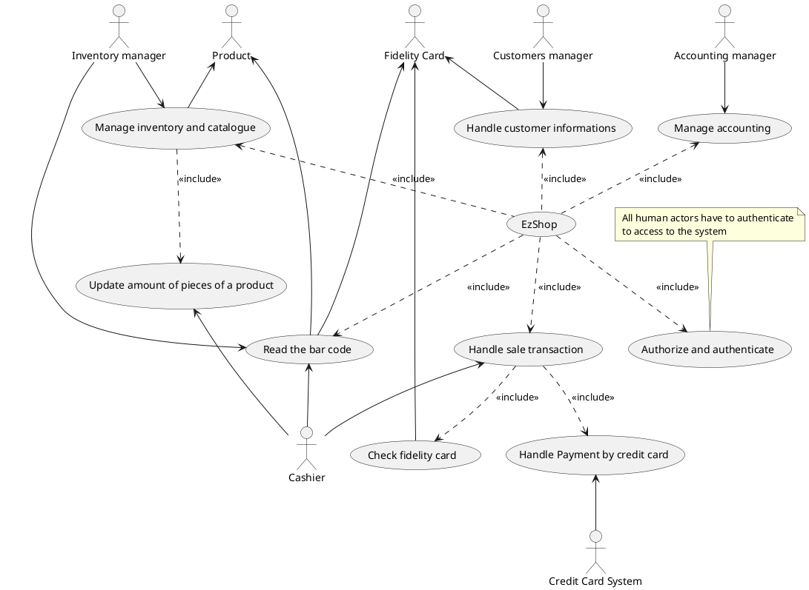

# Requirements Document 

Authors: Group 38

Date: 03/04/2021

Version: 06

| Version | Changes | 
| ----------------- |:-----------|
| 01 | Added Stakeholders  |
| 02 | Added Stories and Personas  |
| 03 | Added Context diagram and interfaces  |
| 04 | Added FR and NFR  |
| 05 | Added Use case diagram  |
| 06 | Minor changes to content |

# Contents

- [Essential description](#essential-description)
- [Stakeholders](#stakeholders)
- [Context Diagram and interfaces](#context-diagram-and-interfaces)
	+ [Context Diagram](#context-diagram)
	+ [Interfaces](#interfaces) 
	
- [Stories and personas](#stories-and-personas)
	+ [Alice](#alice)
	+ [Caroline](#caroline)
	+ [Stefano](#stefano)
- [Functional and non functional requirements](#functional-and-non-functional-requirements)
	+ [Functional Requirements](#functional-requirements)
	+ [Non functional requirements](#non-functional-requirements)
- [Use case diagram and use cases](#use-case-diagram-and-use-cases)
	+ [Use case diagram](#use-case-diagram)
	+ [Use cases](#use-cases)
    	+ [Relevant scenarios](#relevant-scenarios)
- [Glossary](#glossary)
- [System design](#system-design)
- [Deployment diagram](#deployment-diagram)

# Essential description

Small shops require a simple application to support the owner or manager. A small shop (ex a food shop) occupies 50-200 square meters, sells 500-2000 different item types, has one or a few cash registers 
EZShop is a software application to:
* manage sales
* manage inventory
* manage customers
* support accounting

# Stakeholders

| Stakeholder name | Description |
|-----------------|:-----------:|
|Cashier| Uses the software to sell products |
|Customer| Is indirectly involved through the cashier to buy products |  
|Supplier| Supplies all goods and products for the shop |
|Inventory manager| Manages the inventory: amount of pieces, price and (if present) sales. |
|Customers manager| Manages customers' information and fidelity cards |
|Accounting manager|Handler of the accounting system of the shop|
|Software manager| Maintaner of the software product. It is in charge of solving problems related to the software |
|Credit Card System|Allows payments by credit cards from customers using API|
|Fidelity Card|Card used by customers to gain loyalty points|
|Product|Product on sale in the EZShop

# Context Diagram and interfaces

## Context Diagram

## Interfaces

| Actor | Logical Interface | Physical Interface  |
| ------------- |:-------------:| -----:|
|Cashier|GUI|screen, keyboard|
|Product|Bar code|laser beam|
|Inventory Manager|GUI|screen, keyboard|
|Customers Manager|GUI|screen, keyboard|
|Accounting Manager|GUI|screen, keyboard|
|Credit Card System|API|internet connection|
|Fidelity Card|Bar code|laser beam|

# Stories and personas

## Alice
Alice is a 53 years old housewife with a very numerous family. She always takes care of the food shopping for the whole family and really enjoys being rewarded with prizes the more shopping she does. Alice is very impatient and although she buys a lot of goods, she cannot bare waiting for too long at the cashier.
Alice usually goes to the food shop twice a week and gets really mad when she does not find the goods she is looking for on the shelves, sometimes when she does not manage to find a product she usually buys, she just gets out the shop and goes somewhere else.

## Caroline
Caroline is a 31 years old woman, she works at the shop as a cashier and she's always in direct contact with customers. For this reason, she is in charge of accounting the cash desk. Caroline is married and has two children so she doesn't want to stay much longer at the shop after the closing time: she wants to quickly account the cash desk and get back to her children.
In a typically working day, Caroline has to sell many products to people and she expect to have a fast calculation of the total amount of money spent from the customers. She has to ask customers for fidelity card and she also manages cashes and credit cards.
Caroline noticed that sometimes customers ask her to remove or change a product from the transaction, since they changed idea. For this reason, Caroline is interrupted and has to remove the item from the receipt.

## Stefano
Stefano is 35 years old man with professional knowledge about business, administration and operation management. He is a very organized person and is currently focused on his job because he is the owner of EZShop and he is in charge of Accounting Manager, Customers Manager and Inventory Manager.
During the working day, he wakes up at 7 am and goes directly to work after breakfast. Since he is such a responsible man, he likes to arrive earlier than the rest. After some time, he starts doing his job which consists in several actions, such as checking all the products in the inventory, manages customers' informations and does accounting for incomes and expences happening during the day. 
Stefano has high hopes about the new software that is going to be applied to the food shop, since he believes that technology is mandatory to have an optimized system of inventory and sales, and then obtain better results in terms of economic growth and organization. 

# Functional and non functional requirements

## Functional Requirements

| ID        | Description  |
| ------------- |:-------------:| 
| FR1     | Authorize and authenticate |
|  FR1.1  | Log in |
|  FR1.2  | Log out |
|  FR1.3  | Define account |
| FR2     | Handle Customer Informations |
|  FR2.1  | Add a new customer (release a new fidelity card) |
|  FR2.2  | Remove a customer |
|  FR2.3  | Update customers' loyalty points |
| FR3     | Manage Inventory and Catalogue |
|  FR3.1  | Insert a new product |
|  FR3.2  | Remove product |
|  FR3.3  | Update amount of pieces of a product |
| FR4     | Read the bar code |
| FR5     | Handle sale transaction |
|  FR5.1  | Start sale transaction |
|  FR5.2  | Handle receipt |
|   FR5.3.1 | Add product to receipt |
|   FR5.3.2 | Remove product from receipt |
|  FR5.4  | Check fidelity card |
|   FR5.4.1 | Update loyalty points |
|  FR5.5  | Handle Payment by cash |
|  FR5.6 |  Handle Payment by credit card |
|   FR5.6.1 | Never keep track of credit card number |
|  FR5.7  | Update daily income |
|  FR5.8  | End sale transaction |
| FR6     | Manage accounting |
|  FR6.1  | Show incomes |
|  FR6.2  | Add an expence |

## Non Functional Requirements

| ID        | Type (efficiency, reliability, ..)           | Description  | Refers to |
| ------------- |:-------------:| :-----:| -----:|
|  NFR1     |Usability|A very simple and intuitive GUI|all FR|
|  NFR2     |Correctness|Total price of transaction must match the sum of products' prices|FR3,FR5|
|  NFR3     |Efficiency|The transaction must be responsive and fast to compute|FR5|
| NFR4 |Reliability|Software crashes have to be <0.01% of interactions|All FR|
| NFR5 |Maintainability|Adding a new cashier requires less than 2 hours|All FR|
| NFR6 |Security|Data accessed only from authorized users|FR2,FR3,FR5,FR6|
| NFR7 |Usability|Easy detection of missing products for reorders|FR3|
|NFR8|Dependability|Accounting informations always available, consistent and secured|FR6|
|NFR9|Security|Never keep track of credit card number |FR5.6.1|

# Use case diagram and use cases

## Use case diagram

### Use case 1 'Authorize and authenticate', UC1

| Actors Involved        | Inventory manager, Cashier, Customers manager, Accounting manager |
| ------------- |:-------------:| 
|  Precondition     | User has not access to data |  
|  Post condition     | User has access to data|
|  Nominal Scenario     | User log in the system |
|  Variants     | New user |

##### Scenario 1.1 

| Scenario 1.1 | |
| ------------- |:-------------:| 
|  Precondition     | User has not access to data |
|  Post condition     | User has access to data |
| Step#        | Description  |
|  1  Log in    | User has to use its credentials to access to the system |  

##### Scenario 1.2
| Scenario 1.2 | |
| ------------- |:-------------:| 
|  Precondition     | User has not access to data |
|  Post condition     | User has access to data |
| Step#        | Description  |
|  1  Define account    | User has to register himself to the system | 
|  2  Log in    | User has to use its credentials to access to the system | 

### Use case 2 'Handle customer informations', UC2
| Actors Involved        | Customers manager, Fidelity Card, Customer |
| ------------- |:-------------:| 
|  Precondition     | Customer has no fidelity card |  
|  Post condition     | Customer has fidelity card and customer's informations are stored |
|  Nominal Scenario     | Customers Manager receives customer's informations and stores them connected to a specific fidelity card |
|  Variants     | // |

##### Scenario 2.1 

| Scenario 2.1 | |
| ------------- |:-------------:| 
|  Precondition     | Customer has no fidelity card and Manager has no informations about customer |
|  Post condition     | Customer has fidelity card and manager stored informations about customer |
| Step#        | Description  |
|  1     | Customer asks for a fidelity card |  
|  2     | Customer gives to the manager his personal information |
|  3     | Customers Manager stores the information |
|  4     | Customers Manager gives to the customer the associated fidelity card |

### Use case 3 'Manage accounting', UC3
| Actors Involved        | Accounting Manager |
| ------------- |:-------------:| 
|  Precondition     | Accounting Manager successfully logged in the system |  
|  Post condition     | Manager receives total incomes/expences,   Manager can add an expence |
|  Nominal Scenario     | Manager can look at total incomes and expences and eventually add a new expence |
|  Variants     | // |

##### Scenario 3.1 

| Scenario 3.1 | |
| ------------- |:-------------:| 
|  Precondition     | Accounting Manager successfully logged in the system |
|  Post condition     | A new expence registered |
| Step#        | Description  |
|  1     | Manager get the amount of the expence |  
|  2     | Manager add it to the system |
|  3     | New value for total expences is generated |

### Use case 4, UC4
| Actors Involved        |  |
| ------------- |:-------------:| 
|  Precondition     | \<Boolean expression, must evaluate to true before the UC can start> |  
|  Post condition     | \<Boolean expression, must evaluate to true after UC is finished> |
|  Nominal Scenario     | \<Textual description of actions executed by the UC> |
|  Variants     | \<other executions, ex in case of errors> |

##### Scenario 4.1 

\<describe here scenarios instances of UC1>

\<a scenario is a sequence of steps that corresponds to a particular execution of one use case>

\<a scenario is a more formal description of a story>

\<only relevant scenarios should be described>

| Scenario 4.1 | |
| ------------- |:-------------:| 
|  Precondition     | \<Boolean expression, must evaluate to true before the scenario can start> |
|  Post condition     | \<Boolean expression, must evaluate to true after scenario is finished> |
| Step#        | Description  |
|  1     |  |  
|  2     |  |
|  ...     |  |

##### Scenario 4.2

### Use case 5 'Handle sale transaction', UC5
| Actors Involved        | Cashier, Customer |
| ------------- |:-------------:| 
|  Precondition     | Customer has products to pay |  
|  Post condition     | Customer paid for products   Customer receives a receipt |
|  Nominal Scenario     | Handle payments for products by reading bar code, generate total amount and receipt |
|  Variants     | Customer has fidelity card   Customer pay using credit card   Customer wants to remove a product |

##### Scenario 5.1 

| Scenario 5.1 | |
| ------------- |:-------------:| 
|  Precondition     | Customer has products to pay   Customer has no fidelity card   Customer has cash |
|  Post condition     | Customer paid for products   Customer receives a receipt |
| Step#        | Description  |
|  1     | A new transaction starts |
|  2     | Cashier read the bar code from product |  
|  3     | Total amount for receipt is updated |
|  ...     | Iterate for each product |
|  4     | Cashier asks for money |
|  5     | Customer gives the cash |
|  6     | Cashier ends the payment and receipt is generated |

##### Scenario 5.2

| Scenario 5.1 | |
| ------------- |:-------------:| 
|  Precondition     | Customer has products to pay   Customer has fidelity card   Customer has credit card |
|  Post condition     | Customer paid for products   Customer receives a receipt   Loyalty points updated |
| Step#        | Description  |
|  1     | A new transaction starts |
|  2     | Customer gives fidelity card |
|  3     | Cashier read the bar code from fidelity card |
|  2     | Cashier read the bar code from product |  
|  3     | Total amount for receipt is updated |
|  ...     | Iterate for each product |
|  4     | Cashier asks for money |
|  5     | Customer gives the credit card |
|  6     | Cashier will contact credit card system for payment | 
|  7     | Total loyalty points are updated |
|  8     | Cashier ends the payment and receipt is generated |

##### Scenario 5.5

| Scenario 5.5 | |
| ------------- |:-------------:| 
|  Precondition     | Customer has products to pay   Customer changes idea on an already readed product |
|  Post condition     | The unwanted product is removed from receipt |
| Step#        | Description  |
|  1     | A new transaction starts |
|  2     | Cashier read the bar code from product |  
|  3     | Total amount for receipt is updated |
|  ...     | Iterate for each product |
|  4     | Customer wants to remove a product |
|  5     | Cashier removes the product from receipt |
|  4     | Cashier asks for money |
|  5     | Customer gives the cash |
|  6     | Cashier ends the payment and receipt is generated |

# Glossary

\<use UML class diagram to define important terms, or concepts in the domain of the system, and their relationships> 

\<concepts are used consistently all over the document, ex in use cases, requirements etc>

# System Design
\<describe here system design>

\<must be consistent with Context diagram>

# Deployment Diagram 

\<describe here deployment diagram >

