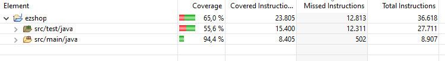

# Unit Testing Documentation

Authors: Group 38

Date: 12/05/2021

Version: 01

# Contents

- [Black Box Unit Tests](#black-box-unit-tests)

- [White Box Unit Tests](#white-box-unit-tests)

# Black Box Unit Tests

    <Define here criteria, predicates and the combination of predicates for each function of each class.
    Define test cases to cover all equivalence classes and boundary conditions.
    In the table, report the description of the black box test case and (traceability) the correspondence with the JUnit test case writing the 
    class and method name that contains the test case>
    <JUnit test classes must be in src/test/java/it/polito/ezshop   You find here, and you can use,  class TestEzShops.java that is executed  
    to start tests
    >

### **Class *EZShopDB* - method *resetDB***

**Criteria for method *name*:**

 - The given table name is contained in database

**Predicates for method *name*:**

| Criteria                                | Predicate |
| --------------------------------------- | --------- |
| The given table name is contained in database | Yes       |
|                                         | No        |

**Boundaries**:

| Criteria | Boundary values |
| -------- | --------------- |
|          |                 |

**Combination of predicates**:

| The given table name is contained in database  | Valid / Invalid | Description of the test case | JUnit test case                    |
| --------------------------------------- | --------------- | -------------------------------- | ---------------------------------- |
| Yes                                     | Valid           | T1("users") -> true  | resetDBTestCase() |
| Yes                                      | Valid         | T2("productTypes") -> true        | ''                                 |
| Yes                                      | Valid         | T3("orders") -> true        | ''                                 |
| No                                      | Invalid         | T4("nonexistingtable") -> false        | ''                                 |

 ### **Class *EZShopDB* - method *getAllUsers***

**Criteria for method *name*:**

 - There are Users in the database

**Predicates for method *name*:**

| Criteria                                | Predicate |
| --------------------------------------- | --------- |
| There are Users in the database| Yes       |
|                                         | No        |

**Boundaries**:

| Criteria | Boundary values |
| -------- | --------------- |
|          |                 |

**Combination of predicates**:

| There are Users in the database  | Valid / Invalid | Description of the test case | JUnit test case                    |
| --------------------------------------- | --------------- | -------------------------------- | ---------------------------------- |
| Yes                                     | Valid           | T1() -> true  | getAllUsersTestCase() |
| No                                      | Invalid         | T2() -> false        | ''                                 |

### **Class *EZShopDB* - method *addUser***

**Criteria for method *name*:**

 - Validity of object User
 - User with unique id in database

**Predicates for method *name*:**

| Criteria                                | Predicate |
| --------------------------------------- | --------- |
| Validity of object User| Yes       |
|                                         | No        |
| User with unique id in database| Yes       |
|                                         | No        |

**Boundaries**:

| Criteria | Boundary values |
| -------- | --------------- |
|          |                 |

**Combination of predicates**:

| Validity of object User  | User with unique id in database| Valid / Invalid | Description of the test case | JUnit test case                    |
| --------------------------------------- | ------------- | --------------- | -------------------------------- | ---------------------------------- |
| Yes                                     | Yes | Valid           | T1(validUser) -> true  | addAndDeleteUserTestCase() |
| No                                      | *|Invalid         | T2(nullUser) -> false        | ''                                 |
| Yes                                     | Yes|Valid           | T3(validUserWithID7) -> true  | addAndDeleteUserTestCase() |
| Yes                                      | No |Invalid         | T4(validUserWithID7) -> false        | ''                                 |

### **Class *EZShopDB* - method *deleteUser***

**Criteria for method *name*:**

 - The given ID is in the database

**Predicates for method *name*:**

| Criteria                                | Predicate |
| --------------------------------------- | --------- |
| The given ID is in the database | Yes       |
|                                         | No        |

**Boundaries**:

| Criteria | Boundary values |
| -------- | --------------- |
|          |                 |

**Combination of predicates**:

| The given ID is in the database  | Valid / Invalid | Description of the test case | JUnit test case                    |
| --------------------------------------- | --------------- | -------------------------------- | ---------------------------------- |
| Yes                                     | Valid           | T1(Existing ID in database) -> true  | addAndDeleteUserTestCase() |
| No                                      | Invalid         | T2(Non-existing ID in database) -> false        | ''                                 |

### **Class *EZShopDB* - method *checkExistingUser***

**Criteria for method *name*:**

 - The given username is in database

**Predicates for method *name*:**

| Criteria                                | Predicate |
| --------------------------------------- | --------- |
| The given username is in database | Yes       |
|                                         | No        |

**Boundaries**:

| Criteria | Boundary values |
| -------- | --------------- |
|          |                 |

**Combination of predicates**:

| The given username is in database  | Valid / Invalid | Description of the test case | JUnit test case                    |
| --------------------------------------- | --------------- | -------------------------------- | ---------------------------------- |
| Yes                                     | Valid           | T1(Existing username in database) -> true  | checkExistingUserTestCase() |
| No                                      | Invalid         | T2(Non-existing username in database) -> false        | ''                                 |

### **Class *EZShopDB* - method *getUserById***

**Criteria for method *name*:**

 - The given ID is in database

**Predicates for method *name*:**

| Criteria                                | Predicate |
| --------------------------------------- | --------- |
| The given ID is in database | Yes       |
|                                         | No        |

**Boundaries**:

| Criteria | Boundary values |
| -------- | --------------- |
|          |                 |

**Combination of predicates**:

| The given ID is in database  | Valid / Invalid | Description of the test case | JUnit test case                    |
| --------------------------------------- | --------------- | -------------------------------- | ---------------------------------- |
| Yes                                     | Valid           | T1(Existing ID in database) -> true  | getUserByIdTestCase() |
| No                                      | Invalid         | T2(Non-existing ID in database) -> false        | ''                                 |

### **Class *EZShopDB* - method *getUserByCredentials***

**Criteria for method *name*:**

 - The given username is in database
 - The given password is in database
 - The pair of username and password matches the database

**Predicates for method *name*:**

| Criteria                                | Predicate |
| --------------------------------------- | --------- |
| The given username is in database | Yes       |
|                                         | No        |
| The given password is in database | Yes       |
|                                         | No        |
| The pair of username and password matches the database | Yes       |
|                                         | No        |

**Boundaries**:

| Criteria | Boundary values |
| -------- | --------------- |
|          |                 |

**Combination of predicates**:

| The given username is in database  | The given password is in database | The pair of username and password matches the database | Valid / Invalid | Description of the test case | JUnit test case                    |
| --------------------------------------- | ------- | ------- |--------------- | -------------------------------- | ---------------------------------- |
| Yes                                 | Yes | Yes | Valid           | T1(Existing credentials in database match) -> true  | getUserByCredentialsTestCase() |
| No                                      | Yes |  No | Invalid         | T2(Non-existing match in database ) -> false        | ''                                 |
| Yes                                     |  No |  No| Invalid           | T3(Non-existing match in database ) -> false  | '' |
| No                                      | No | No| Invalid         | T4(Non-existing match in database ) -> false        | ''                                 |

### **Class *EZShopDB* - method *getLastId***

**Criteria for method *name*:**

 - The ID obtained is equal to the last ID added to database

**Predicates for method *name*:**

| Criteria                                | Predicate |
| --------------------------------------- | --------- |
| The ID obtained is equal to the last ID added to database | Yes       |
|                                         | No        |

**Boundaries**:

| Criteria | Boundary values |
| -------- | --------------- |
|          |                 |

**Combination of predicates**:

| The ID obtained is equal to the last ID added to database  | Valid / Invalid | Description of the test case | JUnit test case                    |
| --------------------------------------- | --------------- | -------------------------------- | ---------------------------------- |
| Yes                                     | Valid           | T1(Last ID in database users) -> true  | getLastIdTestCase() |
| No                                      | Invalid         | T2(Non-existing ID in database users) -> false        | ''                                 |
| Yes                                     | Valid           | T3(Last ID in productType) -> true  | '' |
| No                                      | Invalid         | T4(Non-existing ID in database productType) -> false        | ''                                 |
| Yes                                     | Valid           | T5(Last ID in database customers) -> true  | '' |
| No                                      | Invalid         | T6(Non-existing ID in database customers) -> false        | ''                                 |
| Yes                                     | Valid           | T7(Last ID in database orders) -> true  | '' |
| No                                      | Invalid         | T8(Non-existing ID in database orders) -> false        | ''                                 |

### **Class *EZShopDB* - method *updateUserRole***

**Criteria for method *name*:**

 - The given ID is in database
 - The user role updates

**Predicates for method *name*:**

| Criteria                                | Predicate |
| --------------------------------------- | --------- |
| The given ID is in database | Yes       |
|                                         | No        |
| The user role updates | Yes       |
|                                         | No        |

**Boundaries**:

| Criteria | Boundary values |
| -------- | --------------- |
|          |                 |

**Combination of predicates**:

| The given ID is in database | The user role updates | Valid / Invalid | Description of the test case | JUnit test case                    |
| --------------------------------------- | ------ | --------------- | -------------------------------- | ---------------------------------- |
| Yes                                    | Yes | Valid           | T1(Last ID in database users) -> true. T2(User role is equal to updated role) -> true  | getLastIdTestCase() |
| No                                     | *| Invalid         | T3(Non-existing ID in database users) -> false        | ''                                 |

 ### **Class *ProductTypeClass* - method *validateProductCode***

**Criteria for method *name*:**
	

 - Validity of the string
 - Length of the string
 - Last number is the check of the previous ones

**Predicates for method *name*:**

| Criteria                                      | Predicate                                   |
| --------------------------------------------- | ------------------------------------------- |
| String contains a number                      | Yes                                         |
|                                               | No                                          |
| Length of the string                          | 8, 12, 13, 14, 17, 18                       |
|                                               | [0, 7] , [9, 11], [15, 16], [19, maxDouble] |
| Last number is the check of the previous ones | Yes                                         |
|                                               | No                                          |

**Boundaries**:

| Criteria | Boundary values |
| -------- | --------------- |
|          |                 |

**Combination of predicates**:

| String contains a number | Length of the string | Last number is the check of the previous ones | Valid / Invalid | Description of the test case | JUnit test case |
|-------|-------|-------|-------|-------|-------|
|No|*|*|Invalid|T1("df") -> false  T2("") -> false|validateProductCodeTestCase()|
|*|[0,7]|*|Invalid|T3("1234567") -> false|''|
|*|[9, 11]|*|Invalid|T4("1234567890") -> false|''|
|*|[15, 16]|*|Invalid|T5("333333333333333") -> false|''|
|*|[19, maxDouble]|*|Invalid|T5("44444444444444444444") -> false|''|
|Yes|8|No|Invalid|T6("12345678") -> false|''|
|Yes|8|Yes|Valid|T7("12345670") -> true|''|
|Yes|12|No|Invalid|T8("123456756328") -> true|''|
|Yes|12|Yes|Valid|T9("123456756324") -> false|''|
|Yes|13|No|Invalid|T10("8717163994254") -> false|''|
|Yes|13|Yes|Valid|T11("8717163994250") -> true|''|
|Yes|14|No|Invalid|T12("12344674332822") -> false|''|
|Yes|14|Yes|Valid|T13("12344674332827") -> true|''|
|Yes|17|No|Invalid|T14("12344674332827777") -> false|''|
|Yes|17|Yes|Valid|T15("12344674332827772") -> true|''|
|Yes|18|No|Invalid|T16("123446743328277775") -> false|''|
|Yes|18|Yes|Valid|T17("123446743328277771") -> true|''|

 ### **Class *EZShopDB* - method *checkExistingProductType***

**Criteria for method *name*:**

 - The string is contained in the database

**Predicates for method *name*:**

| Criteria                                | Predicate |
| --------------------------------------- | --------- |
| The string is contained in the database | Yes       |
|                                         | No        |

**Boundaries**:

| Criteria | Boundary values |
| -------- | --------------- |
|          |                 |

**Combination of predicates**:

| The string is contained in the database | Valid / Invalid | Description of the test case | JUnit test case                    |
| --------------------------------------- | --------------- | ---------------------------- | ---------------------------------- |
| Yes                                     | Valid           | T1("8859392701093") -> true  | checkExistingProductTypeTestCase() |
| No                                      | Invalid         | T2("blabla") -> false        | ''                                 |

 ### **Class *EZShopDB* - method *addProductType***

**Criteria for method *name*:**

 - Validity of the object ProductType

**Predicates for method *name*:**

| Criteria                           | Predicate |
| ---------------------------------- | --------- |
| Validity of the object ProductType | Yes       |
|                                    | No        |

**Boundaries**:

| Criteria | Boundary values |
| -------- | --------------- |
|          |                 |

**Combination of predicates**:

| Validity of the object ProductType | Valid / Invalid | Description of the test case | JUnit test case                   |
| ---------------------------------- | --------------- | ---------------------------- | --------------------------------- |
| Yes                                | Valid           | T1(valid PT) -> true         | addAndDeleteProductTypeTestCase() |
| No                                 | Invalid         | T2(NULL) -> false            | ''                                |

### **Class *EZShopDB* - method *updateProductType***

**Criteria for method \*name\*:** 

- Validity of the id parameter
- Validity of the newDescription parameter
- Validity of the newCode parameter
- Validity of the newPrice parameter
- Validity of the newNote parameter

**Predicates for method \*name\*:**

| Criteria                                 | Predicate |
| ---------------------------------------- | --------- |
| Validity of the id parameter             | Yes       |
|                                          | No        |
| Validity of the newDescription parameter | Yes       |
|                                          | No        |
| Validity of the newCode parameter        | Yes       |
|                                          | No        |
| Validity of the newPrice parameter       | Yes       |
|                                          | No        |
| Validity of the newNote parameter        | Yes       |
|                                          | No        |

**Boundaries**:

| Criteria | Boundary values |
| -------- | --------------- |
|          |                 |

**Combination of predicates**:

| Validity of the id parameter | Validity of the newDescription parameter | Validity of the newCode parameter | Validity of the newPrice parameter | Validity of the newNote parameter | Valid / Invalid | Description of the test case           | JUnit test case             |
| ---------------------------- | ---------------------------------------- | --------------------------------- | ---------------------------------- | --------------------------------- | --------------- | -------------------------------------- | --------------------------- |
| No                           | *                                        | *                                 | *                                  | *                                 | Invalid         | T1("d","ok","333","2","good") -> false | updateProductTypeTestCase() |
| *                            | No                                       | *                                 | *                                  | *                                 | Invalid         | T2(100,3,"333","2","good") -> error    | ''                          |
| *                            | *                                        | No                                | *                                  | *                                 | Invalid         | T3(100,"ok",3,"2","good") -> error     | ''                          |
| *                            | *                                        | *                                 | No                                 | *                                 | Invalid         | T4(100,"ok","333",3,"good") -> error   | ''                          |
| *                            | *                                        | *                                 | *                                  | No                                | Invalid         | T5(100,"ok","333","2",3) -> error      | ''                          |
| Yes                          | Yes                                      | Yes                               | Yes                                | Yes                               | Valid           | T6(100,"ok","333","2","good") -> true  | ''                          |

 ### **Class *EZShopDB* - method *deleteProductType***

**Criteria for method *name*:**

 - The given ID is in the database

**Predicates for method *name*:**

| Criteria                        | Predicate |
| ------------------------------- | --------- |
| The given ID is in the database | Yes       |
|                                 | No        |

**Boundaries**:

| Criteria | Boundary values |
| -------- | --------------- |
|          |                 |

**Combination of predicates**:

| The given ID is in the database | Valid / Invalid | Description of the test case           | JUnit test case                   |
| ------------------------------- | --------------- | -------------------------------------- | --------------------------------- |
| Yes                             | Valid           | T1(an ID in the database) -> true      | addAndDeleteProductTypeTestCase() |
| No                              | Invalid         | T2(an ID not in the database) -> false | ''                                |

### **Class *EZShopDB* - method *getAllProductTypes***

**Criteria for method \*name\*:** 

- There are ProductTypes in the database

**Predicates for method \*name\*:**

| Criteria                               | Predicate |
| -------------------------------------- | --------- |
| There are ProductTypes in the database | Yes       |
|                                        | No        |

**Boundaries**:

| Criteria | Boundary values |
| -------- | --------------- |
|          |                 |

**Combination of predicates**:

| There are ProductTypes in the database | Valid / Invalid | Description of the test case | JUnit test case              |
| -------------------------------------- | --------------- | ---------------------------- | ---------------------------- |
| Yes                                    | Valid           | T1() -> List(ProductTypes)   | getAllProductTypesTestCase() |
| No                                     | Invalid         | T2() -> Emptylist            | ''                           |

### **Class *class_name* - method *getProductTypeByBarCode***

**Criteria for method \*name\*:** 

- Validity of the barCode string

**Predicates for method \*name\*:**

| Criteria                       | Predicate |
| ------------------------------ | --------- |
| Validity of the barCode string | Yes       |
|                                | No        |

**Boundaries**:

| Criteria | Boundary values |
| -------- | --------------- |
|          |                 |

**Combination of predicates**:

| Validity of the barCode string | Valid / Invalid | Description of the test case           | JUnit test case                   |
| ------------------------------ | --------------- | -------------------------------------- | --------------------------------- |
| Yes                            | Valid           | T1(a barCode in the DB) -> ProductType | getProductTypeByBarCodeTestCase() |
| No                             | Invalid         | T2(a barCode not in the DB) -> NULL    | ''                                |

### **Class *EZShopDB* - method *getProductTypesByDescription***

**Criteria for method \*name\*:** 

- Validity of the description string

**Predicates for method \*name\*:**

| Criteria                           | Predicate |
| ---------------------------------- | --------- |
| Validity of the description string | Yes       |
|                                    | No        |

**Boundaries**:

| Criteria | Boundary values |
| -------- | --------------- |
|          |                 |

**Combination of predicates**:

| Validity of the description string | Valid / Invalid | Description of the test case                   | JUnit test case                       |
| ---------------------------------- | --------------- | ---------------------------------------------- | ------------------------------------- |
| Yes                                | Valid           | T1(a description in the DB) -> ProductTypeList | getProductTypeByDescriptionTestCase() |
| No                                 | Invalid         | T2(a description not in the DB) -> EmptyList   | ''                                    |

### **Class *EZShopDB* - method *getQuantityByProductTypeId***

**Criteria for method \*name\*:** 

- Validity of the id parameter

**Predicates for method \*name\*:**

| Criteria                     | Predicate |
| ---------------------------- | --------- |
| Validity of the id parameter | Yes       |
|                              | No        |

**Boundaries**:

| Criteria | Boundary values |
| -------- | --------------- |
|          |                 |

**Combination of predicates**:

| Validity of the description string | Valid / Invalid | Description of the test case    | JUnit test case                      |
| ---------------------------------- | --------------- | ------------------------------- | ------------------------------------ |
| Yes                                | Valid           | T1(an ID in the DB) -> quantity | getQuantityByProductTypeIdTestCase() |
| No                                 | Invalid         | T2(an ID not in the DB) -> null | ''                                   |

### **Class *EZShopDB* - method *updateQuantityByProductTypeId***

**Criteria for method \*name\*:** 

- Validity of the id parameter
- Validity of the newQuantity parameter

**Predicates for method \*name\*:**

| Criteria                              | Predicate |
| ------------------------------------- | --------- |
| Validity of the id parameter          | Yes       |
|                                       | No        |
| Validity of the newQuantity parameter | Yes       |
|                                       | No        |

**Boundaries**:

| Criteria | Boundary values |
| -------- | --------------- |
|          |                 |

**Combination of predicates**:

| Validity of the description string | Validity of the newQuantity parameter | NoValid / Invalid | Description of the test case       | JUnit test case                         |
| ---------------------------------- | ------------------------------------- | ----------------- | ---------------------------------- | --------------------------------------- |
| No                                 | *                                     | Invalid           | T1(an ID not in the DB,4) -> false | updateQuantityByProductTypeIdTestCase() |
| *                                  | No                                    | Invalid           | T2(an ID in the DB, "ss") -> error | ''                                      |
| Yes                                | Yes                                   | Valid             | T3(an ID in the DB, 4) -> true     | ''                                      |

### **Class *EZShopDB* - method *isLocationUsed***

**Criteria for method \*name\*:** 

- Parameter pos found in the DB

**Predicates for method \*name\*:**

| Criteria                      | Predicate |
| ----------------------------- | --------- |
| Parameter pos found in the DB | Yes       |
|                               | No        |

**Boundaries**:

| Criteria | Boundary values |
| -------- | --------------- |
|          |                 |

**Combination of predicates**:

| Parameter pos found in the DB | NoValid / Invalid | Description of the test case        | JUnit test case          |
| ----------------------------- | ----------------- | ----------------------------------- | ------------------------ |
| No                            | Invalid           | T1(position not in the db) -> false | isLocationUsedTestCase() |
| Yes                           | Valid             | T2(position in the DB) -> true      | ''                       |

### **Class *EZShopDB* - method *updateProductTypeLocation***

**Criteria for method \*name\*:** 

- Validity of the productId parameter
- Validity of the newPos parameter

**Predicates for method \*name\*:**

| Criteria                            | Predicate |
| ----------------------------------- | --------- |
| Validity of the productId parameter | Yes       |
|                                     | No        |
| Validity of the newPos parameter    | Yes       |
|                                     | No        |

**Boundaries**:

| Criteria | Boundary values |
| -------- | --------------- |
|          |                 |

**Combination of predicates**:

| Validity of the productId parameter | Validity of the newPos parameter | NoValid / Invalid | Description of the test case             | JUnit test case                     |
| ----------------------------------- | -------------------------------- | ----------------- | ---------------------------------------- | ----------------------------------- |
| No                                  | *                                | Invalid           | T1(an ID not in the DB,"4-4-4") -> false | updateProductTypeLocationTestCase() |
| *                                   | No                               | Invalid           | T2(an ID in the DB, 4) -> false          | ''                                  |
| Yes                                 | Yes                              | Valid             | T3(an ID in the DB, "4-4-4") -> true     | ''                                  |

### **Class *EZShopDB* - method *addAndIssueOrder***

**Criteria for method \*name\*:** 

- Validity of the Order object

**Predicates for method \*name\*:**

| Criteria                     | Predicate |
| ---------------------------- | --------- |
| Validity of the Order object | Yes       |
|                              | No        |

**Boundaries**:

| Criteria | Boundary values |
| -------- | --------------- |
|          |                 |

**Combination of predicates**:

| Validity of the Order object | Valid / Invalid | Description of the test case | JUnit test case                      |
| ---------------------------- | --------------- | ---------------------------- | ------------------------------------ |
| Yes                          | Valid           | T1(valid Order) -> true      | addAndIssueOrderThenDeleteTestCase() |
| No                           | Invalid         | T2(NULL) -> false            | ''                                   |

### **Class *EZShopDB* - method *setBalanceIdInOrder***

**Criteria for method \*name\*:** 

- Validity of the orderId parameter
- Validity of the balanceId parameter

**Predicates for method \*name\*:**

| Criteria                            | Predicate |
| ----------------------------------- | --------- |
| Validity of the orderId parameter   | Yes       |
|                                     | No        |
| Validity of the balanceId parameter | Yes       |
|                                     | No        |

**Boundaries**:

| Criteria | Boundary values |
| -------- | --------------- |
|          |                 |

**Combination of predicates**:

| Validity of the orderId parameter | Validity of the balanceId parameter | NoValid / Invalid | Description of the test case       | JUnit test case               |
| --------------------------------- | ----------------------------------- | ----------------- | ---------------------------------- | ----------------------------- |
| No                                | *                                   | Invalid           | T1(an ID not in the DB,4) -> false | setBalanceIdInOrderTestCase() |
| *                                 | No                                  | Invalid           | T2(an ID in the DB, NULL) -> false | ''                            |
| Yes                               | Yes                                 | Valid             | T3(an ID in the DB, 4) -> true     | ''                            |

### **Class *EZShopDB* - method *payOrderById***

**Criteria for method \*name\*:** 

- Validity of the orderId parameter

**Predicates for method \*name\*:**

| Criteria                          | Predicate |
| --------------------------------- | --------- |
| Validity of the orderId parameter | Yes       |
|                                   | No        |

**Boundaries**:

| Criteria | Boundary values |
| -------- | --------------- |
|          |                 |

**Combination of predicates**:

| Validity of the orderId parameter | Valid / Invalid | Description of the test case      | JUnit test case        |
| --------------------------------- | --------------- | --------------------------------- | ---------------------- |
| Yes                               | Valid           | T1(an ID in the database) -> true | payOrderByIdTestCase() |
| No                                | Invalid         | T2(NULL) -> false                 | ''                     |

### **Class *EZShopDB* - method *recordOrderArrivalById***

**Criteria for method \*name\*:** 

- Validity of the orderId parameter

**Predicates for method \*name\*:**

| Criteria                          | Predicate |
| --------------------------------- | --------- |
| Validity of the orderId parameter | Yes       |
|                                   | No        |

**Boundaries**:

| Criteria | Boundary values |
| -------- | --------------- |
|          |                 |

**Combination of predicates**:

| Validity of the orderId parameter | Valid / Invalid | Description of the test case      | JUnit test case                  |
| --------------------------------- | --------------- | --------------------------------- | -------------------------------- |
| Yes                               | Valid           | T1(an ID in the database) -> true | recordOrderArrivalByIdTestCase() |
| No                                | Invalid         | T2(NULL) -> false                 | ''                               |

### **Class *EZShopDB* - method *getAllOrders***

**Criteria for method \*name\*:** 

- There are Orders in the database

**Predicates for method \*name\*:**

| Criteria                         | Predicate |
| -------------------------------- | --------- |
| There are Orders in the database | Yes       |
|                                  | No        |

**Boundaries**:

| Criteria | Boundary values |
| -------- | --------------- |
|          |                 |

**Combination of predicates**:

| There are Orders in the database | Valid / Invalid | Description of the test case | JUnit test case        |
| -------------------------------- | --------------- | ---------------------------- | ---------------------- |
| Yes                              | Valid           | T1() -> List(Order)          | getAllOrdersTestCase() |
| No                               | Invalid         | T2() -> Emptylist            | ''                     |

### **Class *EZShopDB* - method *defineCustomer***

**Criteria for method *name*:**
	

- Validity of the Customer object
- Customer with unique id in database

**Predicates for method *name*:**

| Criterion                           | Predicate |
|-------------------------------------|-----------|
| Validity of the customer object     | Yes       |
|                                     | No        |
| Customer with unique id in database | Yes       |
|                                     | No        |

**Boundaries**:

| Criterion | Boundary values |
|-----------|-----------------|
|           |                 |

**Combination of predicates**:

| Validity of the customer object | Customer with unique id in database | Valid/Invalid | Description of the test case: example of input and output             | JUnit test case                |
|---------------------------------|-------------------------------------|---------------|-----------------------------------------------------------------------|--------------------------------|
| Yes                             | Yes                                 | Valid         | Customer c1 = {"Carlo"} defineCustomer(c1);  -> true   | addAndDeleteCustomerTestCase() |
| Yes                             | No                                  | Invalid       | Customer c2 = {"Carlo"} defineCustomer(c2);   -> false | ''                             |
| No                              | *                                   | Invalid       | T3(NullCustomer) -> false                                             | ''                             |

### **Class *EZShopDB* - method *deleteCustomer***

**Criteria for method *name*:**
	

- Validity of the id parameter

**Predicates for method *name*:**

| Criterion                    | Predicate |
|------------------------------|-----------|
| Validity of the id parameter | Yes       |
|                              | No        |

**Boundaries**:

| Criterion | Boundary values |
|-----------|-----------------|
|           |                 |

 **Combination of predicates**

| Validity of the id parameter | Valid/Invalid | Description of the test case: example of input and output | JUnit test case                |
|------------------------------|---------------|-----------------------------------------------------------|--------------------------------|
| Yes                          | Valid         | T1(Existing ID in database) -> true                  | addAndDeleteCustomerTestCase() |
| No                           | Invalid       | T2(Non-existing ID in database)   -> false           | ''                             |

### **Class *EZShopDB* - method *updateCustomer***

**Criteria for method *name*:**
	

- Validity of the id parameter
- Validity of the newCustomerName parameter
- Validity of the newCustomerCard parameter

**Predicates for method *name*:**

| Criterion                                 | Predicate |
|-------------------------------------------|-----------|
| Validity of the id parameter              | Yes       |
|                                           | No        |
| Validity of the newCustomerName parameter | Yes       |
|                                           | No        |
| Validity of the newCustomerCard parameter | Yes       |
|                                           | No        |

**Boundaries**:

| Criterion | Boundary values |
|-----------|-----------------|
|           |                 |

 **Combination of predicates**

| Validity of the id parameter | Validity of the newCustomerName parameter | Validity of the newCustomerCard parameter | Valid/Invalid | Description of the test case: example of input and output | JUnit test case          |
|------------------------------|-------------------------------------------|-------------------------------------------|---------------|-----------------------------------------------------------|--------------------------|
| Yes                          | Yes                                       | Yes                                       | Valid         | T1(12, "Carlo", "1423373228") -> true                | modifyCustomerTestCase() |
| *                            | *                                         | No                                        | Invalid       | T2(12, "Carlo", "142")  -> error                     | ''                       |
| *                            | No                                        | *                                         | Invalid       | T3(12, "", "1423373228") -> error                    | ''                       |
| No                           | *                                         | *                                         | Invalid       | T4("2", "Carlo", "1423373228")  -> error             | ''                       |

### **Class *EZShopDB* - method *getCustomerById***

**Criteria for method *name*:**
	

- Validity of the id parameter

**Predicates for method *name*:**

| Criterion                    | Predicate |
|------------------------------|-----------|
| Validity of the id parameter | Yes       |
|                              | No        |

**Boundaries**:

| Criterion | Boundary values |
|-----------|-----------------|
|           |                 |

 **Combination of predicates**

| Validity of the id parameter | Valid/Invalid | Description of the test case: example of input and output | JUnit test case           |
|------------------------------|---------------|-----------------------------------------------------------|---------------------------|
| Yes                          | Valid         | T1(a Customerid in DB) -> Customer                   | getCustomerByIdTestCase() |
| No                           | Invalid       | T2(an id not in DB)  -> Null                         | ''                        |

### **Class *EZShopDB* - method *getAllCustomers***

**Criteria for method *name*:** 

- There are ProductTypes in the database

**Predicates for method *name*:**

| Criteria                            | Predicate |
|-------------------------------------|-----------|
| There are Customers in the database | Yes       |
|                                     | No        |

**Boundaries**:

| Criteria | Boundary values |
|----------|-----------------|
|          |                 |

**Combination of predicates**:

| There are ProductTypes in the database | Valid / Invalid | Description of the test case | JUnit test case          |
|----------------------------------------|-----------------|------------------------------|--------------------------|
| Yes                                    | Valid           | T1() -> List(Customer)       | getAllCustomerTestCase() |
| No                                     | Invalid         | T2() -> Emptylist            | ''                       |

### **Class *EZShopDB* - method *createCard***

**Criteria for method *name*:**	

- Validity of the cardId parameter

**Predicates for method *name*:**

| Criterion                        | Predicate |
|----------------------------------|-----------|
| Validity of the cardId parameter | Yes       |
|                                  | No        |

**Boundaries**:

| Criterion | Boundary values |
|-----------|-----------------|
|           |                 |

 **Combination of predicates**

| Validity of the cardId parameter | Valid/Invalid | Description of the test case: example of input and output | JUnit test case      |
|----------------------------------|---------------|-----------------------------------------------------------|----------------------|
| Yes                              | Valid         | T1(CardId unique in DB) -> true                      | createCardTestCase() |
| No                               | Invalid       | T2(Duplicated CardId)  -> false                      | ''                   |

### **Class *EZShopDB* - method *attachCardToCustomer***

**Criteria for method *name*:**	
	

- Validity of the customerId parameter
- Validity of the customerCard parameter

**Predicates for method *name*:**	

| Criterion                              | Predicate |
|----------------------------------------|-----------|
| Validity of the customerId parameter   | Yes       |
|                                        | No        |
| Validity of the customerCard parameter | Yes       |
|                                        | No        |

**Boundaries**:

| Criterion | Boundary values |
|-----------|-----------------|
|           |                 |

 **Combination of predicates**

| Validity of the customerId parameter | Validity of the customerCard parameter | Valid/Invalid | Description of the test case: example of input and output | JUnit test case                |
|--------------------------------------|----------------------------------------|---------------|-----------------------------------------------------------|--------------------------------|
| Yes                                  | Yes                                    | Valid         | T1("2000000000", 12) -> true                         | attachCardToCustomerTestCase() |
| *                                    | No                                     | Invalid       | T2("8000000000", 12)  -> false                       | ''                             |
| No                                   | *                                      | Invalid       | T3("2000000000", 14) -> false                        | ''                             |

### **Class *EZShopDB* - method *getCardPoints***

**Criteria for method *name*:**
	

- Validity of the customerCard parameter

**Predicates for method *name*:**

| Criterion                              | Predicate |
|----------------------------------------|-----------|
| Validity of the customerCard parameter | Yes       |
|                                        | No        |

**Boundaries**:

| Criterion | Boundary values |
|-----------|-----------------|
|           |                 |

 **Combination of predicates**

| Validity of the customerCard parameter | Valid/Invalid | Description of the test case: example of input and output | JUnit test case                  |
|----------------------------------------|---------------|-----------------------------------------------------------|----------------------------------|
| Yes                                    | Valid         | T1(CustomerCard in the DB) -> cardPoints             | updateAndgetCardPointsTestCase() |
| No                                     | Invalid       | T2(CustomerCard not in the DB)  -> null              | ''                               |

### **Class *EZShopDB* - method *updateCardPoints***

**Criteria for method *name*:**
	

- Validity of the customerCard parameter
- Validity of the points parameter

**Predicates for method *name*:**

| Criterion                              | Predicate |
|----------------------------------------|-----------|
| Validity of the customerCard parameter | Yes       |
|                                        | No        |
| Validity of the points parameter       | Yes       |
|                                        | No        |

**Boundaries**:

| Criterion | Boundary values |
|-----------|-----------------|
|           |                 |

 **Combination of predicates**

| Validity of the customerCard parameter | Validity of the points parameter | Valid/Invalid | Description of the test case: example of input and output | JUnit test case                  |
|----------------------------------------|----------------------------------|---------------|-----------------------------------------------------------|----------------------------------|
| Yes                                    | Yes                              | Valid         | T1(a customerCard in the DB, 122) -> true            | updateAndgetCardPointsTestCase() |
| *                                      | No                               | Invalid       | T2(a customerCard not in the DB,"ss")  -> error      | ''                               |
| No                                     | *                                | Invalid       | T3(a customerCard not in the DB,122) -> false        | ''                               |

### **Class *EZShopDB* - method *startSaleTransaction***

**Criteria for method *name*:**
	

- Validity of the SaleTransaction object

**Predicates for method *name*:**

| Criterion                              | Predicate |
|----------------------------------------|-----------|
| Validity of the SaleTransaction object | Yes       |
|                                        | No        |

**Boundaries**:

| Criterion | Boundary values |
|-----------|-----------------|
|           |                 |

 **Combination of predicates**

| Validity of the SaleTransaction object | Valid/Invalid | Description of the test case: example of input and output | JUnit test case                      |
|----------------------------------------|---------------|-----------------------------------------------------------|--------------------------------------|
| Yes                                    | Valid         | T1(valid SaleTransaction) -> transactionId                | startDeleteSaleTransactionTestCase() |
| No                                     | Invalid       | T2(duplicated SaleTransaction insertion) -> -1            | ''                                   |

### **Class *EZShopDB* - method *deleteSaleTransaction***

**Criteria for method *name*:**
	

- Validity of the id parameter

**Predicates for method *name*:**

| Criterion                               | Predicate |
|-----------------------------------------|-----------|
| Validity of the transactionId parameter | Yes       |
|                                         | No        |

**Boundaries**:

| Criterion | Boundary values |
|-----------|-----------------|
|           |                 |

 **Combination of predicates**

| Validity of the transactionId parameter | Valid/Invalid | Description of the test case: example of input and output  | JUnit test case                      |
|-----------------------------------------|---------------|------------------------------------------------------------|--------------------------------------|
| Yes                                     | Valid         | T1(Existing transactionId in database) -> true        | startDeleteSaleTransactionTestCase() |
| No                                      | Invalid       | T2(Non-existing transactionId in database)   -> false | ''                                   |

### **Class *EZShopDB* - method *getSaleTransactionById***

**Criteria for method *name*:**
	

- Validity of the transactionId parameter

**Predicates for method *name*:**

| Criterion                               | Predicate |
|-----------------------------------------|-----------|
| Validity of the transactionId parameter | Yes       |
|                                         | No        |

**Boundaries**:

| Criterion | Boundary values |
|-----------|-----------------|
|           |                 |

 **Combination of predicates**

| Validity of the transactionId parameter | Valid/Invalid | Description of the test case: example of input and output | JUnit test case |
|-----------------------------------------|---------------|-----------------------------------------------------------|-----------------|
| Yes                                     | Valid         | T1(transactionId in DB) -> saleTransaction           |                 |
| No                                      | Invalid       | T2(transactionId not in DB)  -> null                 |                 |

### **Class *EZShopDB* - method *applyDiscountRate***

**Criteria for method *name*:**

- Validity of the transactionId parameter
- Validity of the discountRate parameter

**Predicates for method *name*:**

| Criterion                               | Predicate |
|-----------------------------------------|-----------|
| Validity of the transactionId parameter | Yes       |
|                                         | No        |
| Validity of the productCode parameter   | Yes       |
|                                         | No        |
| Validity of the discountRate parameter  | Yes       |
|                                         | No        |

**Boundaries**:

| Criterion | Boundary values |
|-----------|-----------------|
|           |                 |

 **Combination of predicates**

| Validity of the transactionId parameter | Validity of the discountRate parameter | Valid/Invalid | Description of the test case: example of input and output | JUnit test case                      |
|-----------------------------------------|----------------------------------------|---------------|-----------------------------------------------------------|--------------------------------------|
| Yes                                     | Yes                                    | Valid         | T1(transactionId in the DB, 122) -> true             | applyDiscountToTransactionTestCase() |
| *                                       | No                                     | Invalid       | T2(Invalid discountRate)  -> false                   | ''                                   |
| No                                      | *                                      | Invalid       | T3(Invalid transactionId)  -> false                  | getTransactionByIdTestCase()         |

### **Class *EZShopDB* - method *applyDiscountRateToProduct***

**Criteria for method *name*:**
	

- Validity of the transactionId parameter
- Validity of the productCode parameter
- Validity of the discountRate parameter

**Predicates for method *name*:**

| Criterion                               | Predicate |
|-----------------------------------------|-----------|
| Validity of the transactionId parameter | Yes       |
|                                         | No        |
| Validity of the productCode parameter   | Yes       |
|                                         | No        |
| Validity of the discountRate parameter  | Yes       |
|                                         | No        |

**Boundaries**:

| Criterion | Boundary values |
|-----------|-----------------|
|           |                 |

 **Combination of predicates**

| Validity of the transactionId parameter | Validity of the productCode parameter | Validity of the discountRate parameter | Valid/Invalid | Description of the test case: example of input and output | JUnit test case                    |
|-----------------------------------------|---------------------------------------|----------------------------------------|---------------|-----------------------------------------------------------|------------------------------------|
| Yes                                     | Yes                                   | Yes                                    | Valid         | T1(2, "22345212", 0.4) -> true                       | applyDiscountToProductTestCase()   |
| *                                       | *                                     | No                                     | Invalid       | T2(Invalid discountRate)  -> false                   | ''                                 |
| *                                       | No                                    | *                                      | Invalid       | T3(Invalid productCode) -> false                     | checkExistingProductTypeTestCase() |
| No                                      | *                                     | *                                      | Invalid       | T4(Invalid transactionId)  -> false                  | getTransactionByIdTestCase()       |

### **Class *EZShopDB* - method *createTicketEntry***

**Criteria for method *name*:**
	

- Validity of the ticketEntry parameter
- Validity of the transactionId parameter

**Predicates for method *name*:**

| Criterion                               | Predicate |
|-----------------------------------------|-----------|
| Validity of the ticketEntry parameter   | Yes       |
|                                         | No        |
| Validity of the transactionId parameter | Yes       |
|                                         | No        |

**Boundaries**:

| Criterion | Boundary values |
|-----------|-----------------|
|           |                 |

**Combination of predicates**

| Validity of the ticketEntry parameter | Validity of the transactionId parameter | Valid/Invalid | Description of the test case: example of input and output | JUnit test case              |
|---------------------------------------|-----------------------------------------|---------------|-----------------------------------------------------------|------------------------------|
| Yes                                   | Yes                                     | Valid         | T1(te, 170) -> true                                  | createTicketEntryTestCase()  |
| *                                     | No                                      | Invalid       | T2(transactionId not exists in the DB)  -> false     | getTransactionByIdTestCase() |
| No                                    | *                                       | Invalid       | T3(ticketEntry is null) -> false                     | ''                           |

### **Class *EZShopDB* - method *updateTransactionState***

**Criteria for method *name*:**
	

- Validity of the transactionId parameter
- Validity of the state parameter

**Predicates for method *name*:**

| Criterion                               | Predicate |
|-----------------------------------------|-----------|
| Validity of the transactionId parameter | Yes       |
|                                         | No        |
| Validity of the state parameter         | Yes       |
|                                         | No        |

**Boundaries**:

| Criterion | Boundary values |
|-----------|-----------------|
|           |                 |

 **Combination of predicates**

| Validity of the transactionId parameter | Validity of the state parameter | Valid/Invalid | Description of the test case: example of input and output | JUnit test case                  |
|-----------------------------------------|---------------------------------|---------------|-----------------------------------------------------------|----------------------------------|
| Yes                                     | Yes                             | Valid         | T1(170, "CLOSED") -> true                            | updateTransactionStateTestCase() |
| *                                       | No                              | Invalid       | T2(Null state)  -> false                             | ''                               |
| No                                      | *                               | Invalid       | T3(Invalid transactionId) -> false                   | ''                               |

### **Class *EZShopDB* - method *getClosedSaleTransactionById***

**Criteria for method \*name\*:** 

- Validity of the Sale Transaction ID.

**Predicates for method \*name\*:**

| Criteria                         | Predicate |
| -------------------------------- | --------- |
| Validity of the Sale Transaction ID | Yes       |
|                                  | No        |

**Boundaries**:

| Criteria | Boundary values |
| -------- | --------------- |
|          |                 |

**Combination of predicates**:

| Validity of the Sale Transaction ID | Valid / Invalid | Description of the test case | JUnit test case        |
| -------------------------------- | --------------- | ---------------------------- | ---------------------- |
| Yes                              | Valid           | T1() -> SaleTransactionClass item          | getClosedSaleTransactionTestCase() |
| No                               | Invalid         | T2() -> null           | ''                     |

### **Class *EZShopDB* - method *getProductEntriesByTransactionId***

**Criteria for method \*name\*:** 

- Validity of the Sale Transaction ID.

**Predicates for method \*name\*:**

| Criteria                         | Predicate |
| -------------------------------- | --------- |
| Validity of the Sale Transaction ID | Yes       |
|                                  | No        |

**Boundaries**:

| Criteria | Boundary values |
| -------- | --------------- |
|          |                 |

**Combination of predicates**:

| Validity of the Sale Transaction ID | Valid / Invalid | Description of the test case | JUnit test case        |
| -------------------------------- | --------------- | ---------------------------- | ---------------------- |
| Yes                              | Valid           | T1() -> List(TicketEntry)          | getProductEntriesByTransactionId() |
| No                               | Invalid         | T2() -> Emptylist            | ''                     |

### **Class *EZShopDB* - method *startReturnTransaction***

**Criteria for method \*name\*:** 

- Return Transaction item valid.

**Predicates for method \*name\*:**

| Criteria                         | Predicate |
| -------------------------------- | --------- |
| Return Transaction item valid | Yes       |
|                                  | No        |

**Boundaries**:

| Criteria | Boundary values |
| -------- | --------------- |
|          |                 |

**Combination of predicates**:

| Return Transaction item valid | Valid / Invalid | Description of the test case | JUnit test case        |
| -------------------------------- | --------------- | ---------------------------- | ---------------------- |
| Yes                              | Valid           | T1() -> Return ID          | returnTransactionTestCase() |
| No                               | Invalid         | T2() -> -1            | ''                     |

### **Class *EZShopDB* - method *deleteReturnTransaction***

**Criteria for method \*name\*:** 

- Return Transaction ID valid.

**Predicates for method \*name\*:**

| Criteria                         | Predicate |
| -------------------------------- | --------- |
| Return Transaction ID valid | Yes       |
|                                  | No        |

**Boundaries**:

| Criteria | Boundary values |
| -------- | --------------- |
|          |                 |

**Combination of predicates**:

| Return Transaction ID valid | Valid / Invalid | Description of the test case | JUnit test case        |
| -------------------------------- | --------------- | ---------------------------- | ---------------------- |
| Yes                              | Valid           | T1() -> true          | returnTransactionTestCase() |
| No                               | Invalid         | T2() -> false            | ''                     |

### **Class *EZShopDB* - method *getReturnTransactionById***

**Criteria for method \*name\*:** 

- Return Transaction ID valid.

**Predicates for method \*name\*:**

| Criteria                         | Predicate |
| -------------------------------- | --------- |
| Return Transaction ID valid | Yes       |
|                                  | No        |

**Boundaries**:

| Criteria | Boundary values |
| -------- | --------------- |
|          |                 |

**Combination of predicates**:

| Return Transaction ID valid | Valid / Invalid | Description of the test case | JUnit test case        |
| -------------------------------- | --------------- | ---------------------------- | ---------------------- |
| Yes                              | Valid           | T1() -> ReturnTransactionClass item          | returnTransactionTestCase() |
| No                               | Invalid         | T2() -> null           | ''                     |

### **Class *EZShopDB* - method *getPricePerUnit***

**Criteria for method \*name\*:** 

- Product Code validity.

**Predicates for method \*name\*:**

| Criteria                         | Predicate |
| -------------------------------- | --------- |
| Product Code validity | Yes       |
|                                  | No        |

**Boundaries**:

| Criteria | Boundary values |
| -------- | --------------- |
|          |                 |

**Combination of predicates**:

| Product Code validity | Valid / Invalid | Description of the test case | JUnit test case        |
| -------------------------------- | --------------- | ---------------------------- | ---------------------- |
| Yes                              | Valid           | T1() -> Unit price          | getPriceUnitTestCase() |
| No                               | Invalid         | T2() -> 0            | ''                     |

### **Class *EZShopDB* - method *returnProduct***

**Criteria for method \*name\*:** 

- Return ID validity.
- Product Code present on Sale transaction.
- Amount of the product less than amount present on Sale Transaction.

**Predicates for method \*name\*:**

| Criteria                         | Predicate |
| -------------------------------- | --------- |
| There are Orders in the database | Yes       |
|                                  | No        |
| Valid product Code | Yes       |
|                                  | No        |
| Valid amount of return product | Yes       |
|                                  | No        |

**Boundaries**:

| Criteria | Boundary values |
| -------- | --------------- |
|          |                 |

**Combination of predicates**:

| Are all the parameters valid | Valid / Invalid | Description of the test case | JUnit test case        |
| -------------------------------- | --------------- | ---------------------------- | ---------------------- |
| Yes                              | Valid           | T1() -> true          | returnProductTestCase() |
| No                               | Invalid         | T2() -> false           | ''                     |

### **Class *EZShopDB* - method *getAmountonEntry***

**Criteria for method \*name\*:** 

- Valid transaction Id.
- Valid product Code.

**Predicates for method \*name\*:**

| Criteria                         | Predicate |
| -------------------------------- | --------- |
| Transaction Id is valid | Yes       |
|                                  | No        |
| Product code is valid | Yes       |
|                                  | No        |

**Boundaries**:

| Criteria | Boundary values |
| -------- | --------------- |
|          |                 |

**Combination of predicates**:

| Product code and transaction Id valid | Valid / Invalid | Description of the test case | JUnit test case        |
| -------------------------------- | --------------- | ---------------------------- | ---------------------- |
| Yes                              | Valid           | T1() -> amount          | getAllOrdersTestCase() |
| No                               | Invalid         | T2() -> -1            | ''                     |

### **Class *EZShopDB* - method *getTotalOnEntry***

**Criteria for method \*name\*:** 

- Valid transaction Id.
- Valid product Code.

**Predicates for method \*name\*:**

| Criteria                         | Predicate |
| -------------------------------- | --------- |
| Transaction Id is valid | Yes       |
|                                  | No        |
| Product code is valid | Yes       |
|                                  | No        |

**Boundaries**:

| Criteria | Boundary values |
| -------- | --------------- |
|          |                 |

**Combination of predicates**:

| Product code and transaction Id valid | Valid / Invalid | Description of the test case | JUnit test case        |
| -------------------------------- | --------------- | ---------------------------- | ---------------------- |
| Yes                              | Valid           | T1() -> total          | getTotalOnEntryTestCase() |
| No                               | Invalid         | T2() -> 0.0            | ''                     |

### **Class *EZShopDB* - method *checkProductInSaleTransaction***

**Criteria for method \*name\*:** 
- Valid transaction Id.
- Valid product Code.

**Predicates for method \*name\*:**

| Criteria                         | Predicate |
| -------------------------------- | --------- |
| Transaction Id is valid | Yes       |
|                                  | No        |
| Product code is valid | Yes       |
|                                  | No        |

**Boundaries**:

| Criteria | Boundary values |
| -------- | --------------- |
|          |                 |

**Combination of predicates**:

| Product code and transaction Id valid | Valid / Invalid | Description of the test case | JUnit test case        |
| -------------------------------- | --------------- | ---------------------------- | ---------------------- |
| Yes                              | Valid           | T1() -> true          | returnTransactionTestCase() |
| No                               | Invalid         | T2() -> false          | ''                     |

### **Class *EZShopDB* - method *updateReturnTransaction***

**Criteria for method \*name\*:** 
- Valid return Id.
- Valid amount.
- Valid new return value.

**Predicates for method \*name\*:**

| Criteria                         | Predicate |
| -------------------------------- | --------- |
| Return Id is valid | Yes       |
|                                  | No        |
| Amount is valid | Yes       |
|                                  | No        |
| New return value is valid | Yes       |
|                                  | No        |

**Boundaries**:

| Criteria | Boundary values |
| -------- | --------------- |
|          |                 |

**Combination of predicates**:

| Return ID, Amount and new Value are valid | Valid / Invalid | Description of the test case | JUnit test case        |
| -------------------------------- | --------------- | ---------------------------- | ---------------------- |
| Yes                              | Valid           | T1() -> true          | returnTransactionTestCase() |
| No                               | Invalid         | T2() -> false          | ''                     |

### **Class *EZShopDB* - method *updateSaleTransactionAfterCommit***

**Criteria for method \*name\*:** 

- Transaction ID is valid.
- New return value is valid.

**Predicates for method \*name\*:**

| Criteria                         | Predicate |
| -------------------------------- | --------- |
| Transaction ID is valid | Yes       |
|                                  | No        |
| New return value is valid | Yes       |
|                                  | No        |

**Boundaries**:

| Criteria | Boundary values |
| -------- | --------------- |
|          |                 |

**Combination of predicates**:

| There are Orders in the database | Valid / Invalid | Description of the test case | JUnit test case        |
| -------------------------------- | --------------- | ---------------------------- | ---------------------- |
| Yes                              | Valid           | T1() -> true         | updateSaleTransactionAfterCommitTestCase() |
| No                               | Invalid         | T2() -> false            | ''                     |

### **Class *EZShopDB* - method *updateEntryAfterCommit***

**Criteria for method \*name\*:** 

- Transaction ID is valid.
- Product Code is valid.
- New amount is valid.
- New total sold is valid.

**Predicates for method \*name\*:**

| Criteria                         | Predicate |
| -------------------------------- | --------- |
| Transaction ID is valid | Yes       |
|                                  | No        |
| Product Code is valid | Yes       |
|                                  | No        |
| New amount is valid | Yes       |
|                                  | No        |
| New total sold is valid | Yes       |
|                                  | No        |

**Boundaries**:

| Criteria | Boundary values |
| -------- | --------------- |
|          |                 |

**Combination of predicates**:

| All the parameters are valid | Valid / Invalid | Description of the test case | JUnit test case        |
| -------------------------------- | --------------- | ---------------------------- | ---------------------- |
| Yes                              | Valid           | T1() -> true         | updateEntryAfterCommitTestCase() |
| No                               | Invalid         | T2() -> false            | ''                     |

### **Class *EZShopDB* - method *getAllProductReturnsById***

**Criteria for method \*name\*:** 

- Return ID is valid.

**Predicates for method \*name\*:**

| Criteria                         | Predicate |
| -------------------------------- | --------- |
| Return ID is valid | Yes       |
|                                  | No        |

**Boundaries**:

| Criteria | Boundary values |
| -------- | --------------- |
|          |                 |

**Combination of predicates**:

| Return ID is valid. | Valid / Invalid | Description of the test case | JUnit test case        |
| -------------------------------- | --------------- | ---------------------------- | ---------------------- |
| Yes                              | Valid           | T1() -> List(ReturnProducts)          | getAllProductReturnsTestCase() |
| No                               | Invalid         | T2() -> Emptylist            | ''                     |

### **Class *EZShopDB* - method *deleteProductReturnsByReturnId***

**Criteria for method \*name\*:** 

- Return ID is valid.

**Predicates for method \*name\*:**

| Criteria                         | Predicate |
| -------------------------------- | --------- |
| Return ID is valid | Yes       |
|                                  | No        |

**Boundaries**:

| Criteria | Boundary values |
| -------- | --------------- |
|          |                 |

**Combination of predicates**:

| Return ID is valid | Valid / Invalid | Description of the test case | JUnit test case        |
| -------------------------------- | --------------- | ---------------------------- | ---------------------- |
| Yes                              | Valid           | T1() -> true       | deleteProductReturnsTestCase() |
| No                               | Invalid         | T2() -> false            | ''                     |

### **Class *EZShopDB* - method *updatePaymentSaleTransaction***

**Criteria for method \*name\*:** 

- Transaction ID is valid.
- Payment method is valid.
- State of the transaction is valid.

**Predicates for method \*name\*:**

| Criteria                         | Predicate |
| -------------------------------- | --------- |
| Transaction ID is valid | Yes       |
|                                  | No        |
| Payment method is valid | Yes       |
|                                  | No        |
| State of the transaction is valid | Yes       |
|                                  | No        |

**Boundaries**:

| Criteria | Boundary values |
| -------- | --------------- |
|          |                 |

**Combination of predicates**:

| Transaction, payment method and state are valid | Valid / Invalid | Description of the test case | JUnit test case        |
| -------------------------------- | --------------- | ---------------------------- | ---------------------- |
| Yes                              | Valid           | T1() -> true         | updatePaymentSaleTransactionTestCase() |
| No                               | Invalid         | T2() -> false            | ''                     |

### **Class *EZShopDB* - method *recordBalanceOperation***

**Criteria for method \*name\*:** 

- The given balance operation item must be valid.

**Predicates for method \*name\*:**

| Criteria                         | Predicate |
| -------------------------------- | --------- |
| Balance operation item is valid | Yes       |
|                                  | No        |

**Boundaries**:

| Criteria | Boundary values |
| -------- | --------------- |
|          |                 |

**Combination of predicates**:

| Balance operation item is valid | Valid / Invalid | Description of the test case | JUnit test case        |
| -------------------------------- | --------------- | ---------------------------- | ---------------------- |
| Yes                              | Valid           | T1() -> true         | recordBalanceOperationTestCase() |
| No                               | Invalid         | T2() -> false            | ''                     |

### **Class *EZShopDB* - method *getActualBalance***

**Criteria for method \*name\*:** 

- There have to be some recorded balance operations in the database.

**Predicates for method \*name\*:**

| Criteria                         | Predicate |
| -------------------------------- | --------- |
| There are Balance Operations in the database | Yes       |
|                                  | No        |

**Boundaries**:

| Criteria | Boundary values |
| -------- | --------------- |
|          |                 |

**Combination of predicates**:

| There are Balance Operations in the database | Valid / Invalid | Description of the test case | JUnit test case        |
| -------------------------------- | --------------- | ---------------------------- | ---------------------- |
| Yes                              | Valid           | T1() -> total          | getActualBalanceTestCase() |
| No                               | Invalid         | T2() -> 0           | ''                     |
**Combination of predicates**:

| There are Orders in the database | Valid / Invalid | Description of the test case | JUnit test case        |
| -------------------------------- | --------------- | ---------------------------- | ---------------------- |
| Yes                              | Valid           | T1() -> List(Order)          | getAllOrdersTestCase() |
| No                               | Invalid         | T2() -> Emptylist            | ''                     |

### **Class *EZShopDB* - method *getBalanceOperations***

**Criteria for method \*name\*:** 

- The start date is valid.
- The end date is valid.

**Predicates for method \*name\*:**

| Criteria                         | Predicate |
| -------------------------------- | --------- |
| There start date is valid | Yes       |
|                                  | No        |
| There end date is valid | Yes       |
|                                  | No        |

**Boundaries**:

| Criteria | Boundary values |
| -------- | --------------- |
|          |                 |

**Combination of predicates**:

| The dates are valid | Valid / Invalid | Description of the test case | JUnit test case        |
| -------------------------------- | --------------- | ---------------------------- | ---------------------- |
| Yes                              | Valid           | T1() -> List(BalanceOperation)          | getBalanceOperationsTestCase() |
| No                               | Invalid         | T2() -> Emptylist            | ''                     |

### **Class *EZShopDB* - method *getCreditCardByCardNumber***

**Criteria for method \*name\*:** 

- Card Number is valid.

**Predicates for method \*name\*:**

| Criteria                         | Predicate |
| -------------------------------- | --------- |
| Card Number is valid | Yes       |
|                                  | No        |

**Boundaries**:

| Criteria | Boundary values |
| -------- | --------------- |
|          |                 |

**Combination of predicates**:

| Credit Card number is valid | Valid / Invalid | Description of the test case | JUnit test case        |
| -------------------------------- | --------------- | ---------------------------- | ---------------------- |
| Yes                              | Valid           | T1() -> Card item         | getCreditCardTestCase() |
| No                               | Invalid         | T2() -> null            | ''                     |

### **Class *EZShopDB* - method *updateBalanceInCreditCard***

**Criteria for method \*name\*:** 

- Credit Card number is valid.

**Predicates for method \*name\*:**

| Criteria                         | Predicate |
| -------------------------------- | --------- |
| Credit Card number is valid | Yes       |
|                                  | No        |

**Boundaries**:

| Criteria | Boundary values |
| -------- | --------------- |
|          |                 |

**Combination of predicates**:

| Credit Card number is valid | Valid / Invalid | Description of the test case | JUnit test case        |
| -------------------------------- | --------------- | ---------------------------- | ---------------------- |
| Yes                              | Valid           | T1() -> true          | updateBalanceTestCase() |
| No                               | Invalid         | T2() -> false            | ''                     |

# White Box Unit Tests

### Test cases definition

    <JUnit test classes must be in src/test/java/it/polito/ezshop>
    <Report here all the created JUnit test cases, and the units/classes under test >
    <For traceability write the class and method name that contains the test case>

| Unit name | JUnit test case |
|--|--|
|ProductType|getterAndSetterProductTypeTestCase()|
|Order|getterAndSetterOrderTestCase()|
|User|getterAndSetterUserTestCase()|
|Customer|getterAndSetterCustomerTestCase()|
|BalanceOperation|getterAndSetterBalanceOperationTestCase()|
|ReturnTransaction|getterAndSetterReturnTransactionTestCase()|
|ProductReturn|getterAndSetterProductReturnTestCase()|
|TicketEntry|getterAndSetterTicketEntryTestCase()|
|SaleTransaction|getterAndSetterSaleTransactionTestCase()|
|CreditCard|getterAndSetterCreditCardTestCase()|

### Code coverage report

### Loop coverage analysis
|Unit name | Loop rows | Number of iterations | JUnit test case |
|---|---|---|---|
|getAllProductTypes|12|0|loopCoverageTestCase()|
|getAllProductTypes|12|1|loopCoverageTestCase()|
|getAllProductTypes|12|2|loopCoverageTestCase()|

